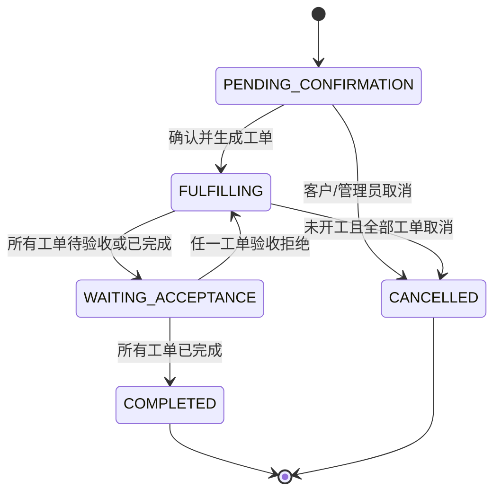
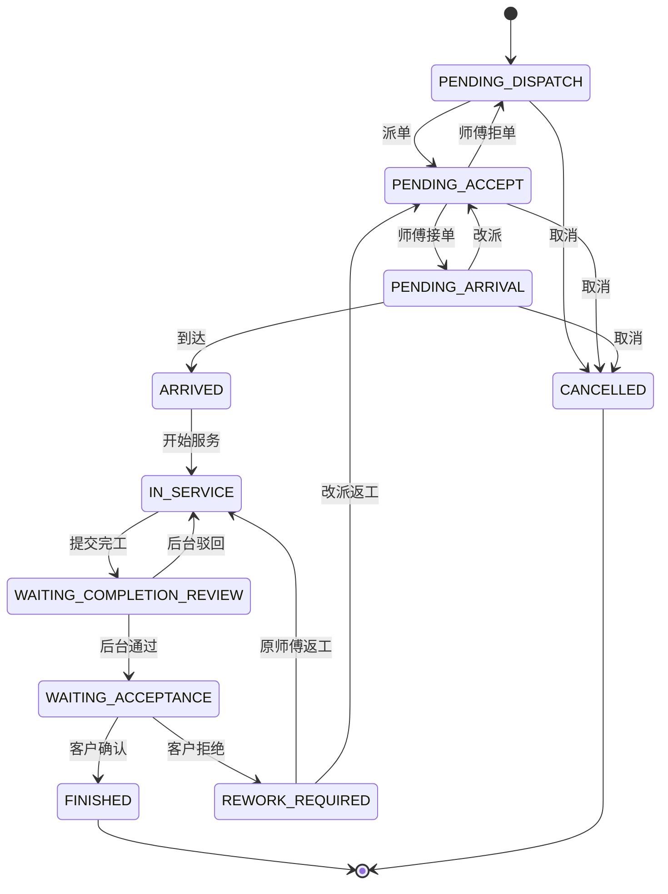

# SPEC-004｜订单履约与工单派单链路

**状态：** Draft for review  
**版本：** V1.0  
**日期：** 2026-08-09  
**适用工程：** `apps/server-go`、`apps/admin-web`、`apps/wechat-mini`  
**上游依据：** 产品方案 V1、技术方案 V1、SPEC-001、SPEC-003

---

## 1. 结论

本期交付一条可演示、可追溯、可自动验收的履约纵向链路：

```text
客户在微信小程序下单
→ 调度在 React 后台确认订单
→ 系统按订单项生成工单
→ 调度设置上门时间并派给师傅
→ 师傅接单、到达、开始服务
→ 师傅提交完工说明及施工前后图片
→ 后台审核完工
→ 客户在小程序确认完成
→ 订单与工单完成
```

本期不实现微信支付、报价、材料库存、智能派单和售后返修，但数据和状态设计不得破坏后续扩展。

---

## 2. 当前基线与缺口

### 2.1 已有能力

- 管理后台统一管理和发布维修 SKU；
- 小程序动态展示已发布 SKU；
- 服务端购物车、故障描述、故障媒体和幂等下单；
- PostgreSQL 保存订单、订单项、SKU 版本快照和故障证据；
- 后台已支持订单列表与订单详情；
- 数据库已有 `employee_account`、`work_order` 和 `work_order_status_history` 基础表。

### 2.2 当前缺口

- 订单不能确认、取消或转为履约；
- 订单创建后固定为 `WAITING_PAYMENT`，但当前没有支付能力；
- 订单项和工单之间没有关联表；
- 没有师傅目录、派单、改派、预约和师傅待办；
- 没有工单状态命令、完工证据、后台审核和客户验收；
- 小程序“我的订单”和“师傅工作台”仍为占位能力；
- 履约事实尚未形成完整时间线。

---

## 3. 目标与成功标准

### 3.1 业务目标

1. 订单进入后台后可被业务人员真实处理，而不只是只读查看。
2. 一个包含多个维修诉求的订单可拆成多张可独立派发的工单。
3. 派单、改派、状态流转、完工证据和验收全部可追溯。
4. 客户可以在小程序看到订单与各子工单的实时进度。
5. 师傅只能处理派给自己的工单。

### 3.2 验收成功标准

1. 调度可以确认一张待确认订单，并在同一事务内生成工单。
2. 每个订单项默认生成一张工单，不遗漏、不重复。
3. 调度只能选择启用状态的师傅，派单时必须填写上门时间。
4. 师傅可以接单或填写原因拒单；拒单后工单回到待派单。
5. 师傅可以按规则执行到达、开始服务和提交完工。
6. 无完工说明、施工前图片或施工后图片时，不能提交完工。
7. 后台审核通过后，客户可在小程序查看服务结果并确认完成。
8. 同一状态命令重试不得产生重复工单、重复历史或越级流转。
9. 两个调度同时操作同一工单时，只有一个操作成功，另一个获得版本冲突。
10. 工单全流程的状态、操作人、原因和时间可在后台查看。
11. 当一张订单的所有工单都验收完成后，订单自动转为 `COMPLETED`。

---

## 4. 本期范围

### 4.1 包含

- 订单待确认、确认转工单、有限取消和状态时间线；
- 一个订单项默认一张工单的确定性拆单；
- 后台师傅目录的新增、列表和启停；
- 工单列表、详情、按状态/师傅/订单号筛选；
- 派单、改派、预约改期和派单历史；
- 师傅工作台：待接、待上门、服务中、待补充；
- 接单、拒单、到达、开始服务、上传完工证据、提交完工；
- 后台完工审核通过/驳回；
- 客户小程序订单列表、订单详情、工单进度和验收确认；
- 订单状态历史、工单状态历史、派单历史和媒体权限；
- PostgreSQL migration、Go 集成测试、React 与小程序联调。

### 4.2 暂不包含

- 微信支付、定金、尾款、退款和发票；
- 勘察报价、增项单、多方案报价和客户在线议价；
- 材料目录、库存、领料、退料和成本核算；
- 定位签到真实地理围栏、导航、隐私号和通话；
- 智能派单、技能匹配、路线规划和自动抢单；
- 企业项目、批量建单、SLA 告警、合同价和对账；
- 质保凭证、售后申请、返修工单和争议处理；
- 师傅提成、工资和结算；
- 客户签字、验收码和微信订阅消息；
- 离线草稿和弱网自动同步。

---

## 5. 角色与权限

| 角色 | 本期操作 | 不允许 |
| --- | --- | --- |
| 客户 | 查看自己订单/工单、查看客户可见证据、确认验收 | 查看他人订单、派单、改状态、查看内部审核备注 |
| 调度/管理员 | 确认/取消订单、管理师傅、派单/改派/改期、查看时间线、审核完工 | 删除历史和已归档证据、静默修改订单快照 |
| 师傅 | 查看分配给自己的工单、接/拒单、到达、开始、上传证据、提交完工 | 查看他人工单、自行改派、改价、直接标记客户已验收 |

本地环境沿用当前简化认证：

- 管理员：Basic Auth `admin / change-me-in-production`；
- 客户：`Bearer local-customer-1`；
- 师傅：`Bearer local-worker-{employeeId}`。

生产微信登录、员工 SSO 和正式 RBAC 不属于本切片，但 Service 层必须基于 `Principal` 检查组织、角色和资源归属，不得只依赖前端隐藏按钮。

---

## 6. 核心产品决策

### 6.1 订单和工单分工

- 订单是客户交易与多诉求汇总容器，保留客户、地址、金额和 SKU 快照；
- 工单是一次可独立调度和现场履约的任务，保留师傅、预约、进度和证据；
- 修改工单不得回写 SKU 或订单项快照；
- 一张订单可关联多张工单，客户仍以订单为总览入口。

### 6.2 首期拆单规则

首期采用确定性规则：**一个 `order_item` 默认生成一张 `work_order`**。

- 同一订单项中的数量不再拆分；
- 确认订单的事务必须锁定订单并检查是否已生成工单；
- 每个订单项在本期最多关联一张主工单；
- 后续引入分批履约时，再通过 migration 放宽该约束，不在首期建设通用拆单引擎。

### 6.3 支付与履约解耦

当前没有支付能力，因此不保留一个无法流转的假“待支付”前置。

- 小程序下单后，订单状态由 `WAITING_PAYMENT` 改为 `PENDING_CONFIRMATION`；
- 存量 `WAITING_PAYMENT` 且 `paid_amount=0` 的本地/测试订单在 migration 中转为 `PENDING_CONFIRMATION`；
- 调度确认后订单进入 `FULFILLING`；
- 后续接入支付时新增独立 `payment_status`、支付单和应收规则，不再让订单主状态同时表达支付与履约。

### 6.4 快照与证据不可篡改

- 工单通过 `work_order_item` 引用订单项快照；
- 完工证据只能追加和逻辑作废，不得覆盖原文件；
- 工单进入 `WAITING_COMPLETION_REVIEW` 后，本次提交的完工说明和证据集合冻结；
- 审核驳回后通过新的证据和新历史补充，不删除旧提交。

---

## 7. 业务流程


### 7.1 订单确认

1. 调度打开订单详情，查看联系人、地址、故障描述和媒体。
2. 调度点击“确认订单并生成工单”。
3. 后端锁定订单，检查状态、版本、订单项和已有工单。
4. 后端为每个订单项生成工单和 `work_order_item`。
5. 订单转为 `FULFILLING`，工单初始为 `PENDING_DISPATCH`。
6. 订单状态历史和工单初始历史在同一事务中写入。

### 7.2 派单与改派

1. 调度在工单详情选择启用师傅和上门时间。
2. 首次派单：`PENDING_DISPATCH -> PENDING_ACCEPT`。
3. 师傅拒单后：清空当前师傅，`PENDING_ACCEPT -> PENDING_DISPATCH`。
4. 改派仅允许在 `PENDING_ACCEPT`、`PENDING_ARRIVAL` 或 `REWORK_REQUIRED` 进行，原因必填。
5. 改派后回到 `PENDING_ACCEPT`，新师傅必须重新接单。
6. 工单已进入 `IN_SERVICE` 时不允许直接改派；首期由管理员驳回或标记异常后处理。

### 7.3 师傅履约

1. 师傅只能在 `PENDING_ACCEPT` 接单或拒单。
2. 接单后进入 `PENDING_ARRIVAL`。
3. 到达命令记录服务端时间，首期不强制定位，进入 `ARRIVED`。
4. 开始命令仅允许 `ARRIVED -> IN_SERVICE`。
5. 施工中可追加 `BEFORE`、`DURING`、`AFTER` 证据。
6. 提交完工前必须有 5—1000 字完工说明、至少 1 张 `BEFORE` 图片和 1 张 `AFTER` 图片。
7. 提交后进入 `WAITING_COMPLETION_REVIEW`。

### 7.4 完工审核与客户验收

- 后台通过：`WAITING_COMPLETION_REVIEW -> WAITING_ACCEPTANCE`；
- 后台驳回：原因必填，`WAITING_COMPLETION_REVIEW -> IN_SERVICE`；
- 客户确认：`WAITING_ACCEPTANCE -> FINISHED`；
- 客户拒绝验收：原因必填，`WAITING_ACCEPTANCE -> REWORK_REQUIRED`；
- `REWORK_REQUIRED` 由调度选择返回原师傅或改派，分别进入 `IN_SERVICE` 或 `PENDING_ACCEPT`；
- 所有工单都为 `FINISHED` 后，订单自动转为 `COMPLETED`。

---

## 8. 状态机

### 8.1 订单状态



| 状态 | 含义 |
| --- | --- |
| `PENDING_CONFIRMATION` | 客户已提交，待业务确认 |
| `FULFILLING` | 已生成工单，正在派单或施工 |
| `WAITING_ACCEPTANCE` | 所有未完成工单均已等待客户验收 |
| `COMPLETED` | 全部工单验收完成 |
| `CANCELLED` | 订单已取消，不再履约 |

### 8.2 工单状态



状态机是服务端唯一事实源。前端不得通过直接传入任意 `status` 修改状态，只能调用显式命令接口。

---

## 9. 关键业务规则

### 9.1 订单确认与取消

- 仅 `PENDING_CONFIRMATION` 可执行确认；
- 确认命令需携带订单 `version` 和 `Idempotency-Key`；
- 确认订单、生成全部工单、写入历史和更新订单状态必须在同一 PostgreSQL 事务中完成；
- 客户只能取消自己的 `PENDING_CONFIRMATION` 订单，原因必填；
- 管理员可取消 `PENDING_CONFIRMATION`，或在所有工单都未进入 `ARRIVED`/`IN_SERVICE` 时取消履约中订单；
- 取消履约中订单时，所有非终态工单在同一事务内转为 `CANCELLED`。

### 9.2 派单

- 师傅必须属于同一 `org_id`、`role='WORKER'`且 `status='ACTIVE'`；
- `appointmentAt` 必须晚于当前服务端时间，首期不做班次与时间冲突自动阻断；
- 首次派单可填备注，改派原因必填；
- 每次派单/改派都写入独立派单历史，包含旧/新师傅、旧/新预约时间、操作人和原因；
- 师傅状态被禁用不得自动改派存量工单，后台需显示待处理提示。

### 9.3 工单证据

- 首期完工证据只接受图片，单张最大 10 MB；
- 节点：`BEFORE`、`DURING`、`AFTER`；
- 每张图片必须记录工单、节点、上传人、服务端时间和媒体 ID；
- 仅当前被派师傅可在 `PENDING_ARRIVAL`、`ARRIVED`、`IN_SERVICE` 上传；
- 管理员可查看全部证据，客户只能查看 `customer_visible=true` 的证据；
- 上传与绑定分离：先创建 `media_asset`，再在校验权限和状态后绑定到工单。

### 9.4 订单汇总状态

每次工单状态改变后，后端在同一事务内重算订单状态：

1. 任一非终态工单处于待派、待接、待上门、服务中、待审核或返工：`FULFILLING`；
2. 没有上述工单，且至少一张为 `WAITING_ACCEPTANCE`：`WAITING_ACCEPTANCE`；
3. 全部为 `FINISHED`：`COMPLETED`；
4. 全部为 `CANCELLED`：`CANCELLED`。

---

## 10. 数据模型与 Migration

### 10.1 `customer_order` 调整

- 复用已有 `version`，所有命令使用乐观锁；
- 新增 `confirmed_at TIMESTAMPTZ(3) NULL`；
- 新增 `completed_at TIMESTAMPTZ(3) NULL`；
- 新增 `cancelled_at TIMESTAMPTZ(3) NULL`；
- 新增 `cancel_reason VARCHAR(512) NULL`；
- 存量测试数据状态按 6.3 节迁移；
- 为存量订单补一条 `from_status=NULL`、`to_status=迁移后状态`、`event_code='ORDER_MIGRATED'` 的初始历史，不伪造原始操作人。

### 10.2 `order_status_history` 新表

| 字段 | 要求 |
| --- | --- |
| `id` | identity 主键 |
| `org_id` / `order_id` | 组织与订单 |
| `from_status` / `to_status` | 前后状态 |
| `event_code` | `ORDER_CREATED`、`ORDER_CONFIRMED`、`ORDER_ROLLED_UP`、`ORDER_CANCELLED` |
| `operator_type` | `CUSTOMER`、`ADMIN`、`SYSTEM` |
| `operator_id` / `operator_name` | 操作人快照，系统操作 ID 为 0 |
| `reason` | 取消、逆向流转必填 |
| `created_at` | 服务端时间 |

索引：`(org_id, order_id, created_at, id)`。

### 10.3 `employee_account` 调整

- 新增 `role VARCHAR(32) NOT NULL DEFAULT 'WORKER'`，本期只允许 `WORKER`；
- 新增 `mobile VARCHAR(32) NULL`；
- 密码字段本期保留，但本地 worker token 不使用该密码登录；
- 新增师傅时由服务端写入随机且不可用于登录的密码哈希，不使用默认明文密码；
- 新增本地演示师傅种子数据，不使用真实人员信息。

### 10.4 `work_order` 调整

保留已有 `order_id`、`assignee_id`、`status`、`priority`、`appointment_at`、`sla_at`、`version`，新增：

- `accepted_at`、`arrived_at`、`started_at`；
- `completion_submitted_at`、`reviewed_at`、`finished_at`、`cancelled_at`；
- `completion_summary VARCHAR(1000) NULL`；
- `review_note VARCHAR(512) NULL`；
- `exception_code VARCHAR(64) NULL`；
- `cancel_reason VARCHAR(512) NULL`。

工单号全局唯一，建议格式 `WO{yyyyMMddHHmmss}{sequence}`；API 仍把 ID 序列化为字符串。

### 10.5 `work_order_item` 新表

| 字段 | 要求 |
| --- | --- |
| `id` | identity 主键 |
| `org_id` / `work_order_id` / `order_item_id` | 组织、工单和订单项 |
| `quantity` | 本工单履约数量，本期等于订单项数量 |
| `created_at` | 创建时间 |

约束：

- `UNIQUE (org_id, work_order_id, order_item_id)`；
- 本期增加 `UNIQUE (org_id, order_item_id)` 确保一个订单项只生成一张工单；
- 后续分批履约上线前必须通过新 migration 和数量守恒约束替换第二个唯一键。

### 10.6 `work_order_assignment_history` 新表

字段至少包含：

- `work_order_id`、`from_assignee_id`、`to_assignee_id`；
- `from_appointment_at`、`to_appointment_at`；
- `event_code`：`ASSIGNED`、`REASSIGNED`、`REJECTED`、`RESCHEDULED`；
- `operator_type`、`operator_id`、`operator_name`、`reason`、`created_at`。

索引：`(org_id, work_order_id, created_at, id)`。

### 10.7 `work_order_status_history` 调整

在已有表增加：

- `operator_type VARCHAR(32) NOT NULL DEFAULT 'SYSTEM'`；
- `operator_name VARCHAR(64) NOT NULL DEFAULT 'system'`。

所有状态变更必须在更新主表的同一事务中写历史。

### 10.8 `work_order_evidence` 新表

| 字段 | 要求 |
| --- | --- |
| `work_order_id` / `media_id` | 工单与媒体 |
| `stage` | `BEFORE`、`DURING`、`AFTER` |
| `customer_visible` | 默认 `true` |
| `uploaded_by` | 师傅 employee ID |
| `created_at` | 服务端时间 |

约束：`UNIQUE (org_id, work_order_id, media_id)`；索引：`(org_id, work_order_id, stage, created_at)`。

---

## 11. API 契约

所有 JSON 继续使用 `{code,message,data,requestId}` 响应外壳，ID 使用字符串，时间使用 RFC3339，金额单位为分。命令接口必须携带 `version`；会创建资源或用户可重试的命令还必须携带 `Idempotency-Key`。

### 11.1 管理端订单

| Method | Path | 用途 |
| --- | --- | --- |
| `GET` | `/api/v1/admin/orders` | 扩展状态筛选，返回工单汇总 |
| `GET` | `/api/v1/admin/orders/{id}` | 返回订单项、工单和时间线 |
| `POST` | `/api/v1/admin/orders/{id}/confirm` | 确认订单并生成工单 |
| `POST` | `/api/v1/admin/orders/{id}/cancel` | 按规则取消订单 |

`POST /admin/orders/{id}/confirm`：

```json
{
  "version": 0,
  "priority": "NORMAL"
}
```

返回：

```json
{
  "orderId": "2001",
  "orderStatus": "FULFILLING",
  "workOrders": [
    { "id": "3001", "workOrderNo": "WO202608090001", "status": "PENDING_DISPATCH" }
  ]
}
```

### 11.2 师傅目录

| Method | Path | 用途 |
| --- | --- | --- |
| `GET` | `/api/v1/admin/workers?status=ACTIVE` | 派单选择器 |
| `POST` | `/api/v1/admin/workers` | 新增师傅 |
| `POST` | `/api/v1/admin/workers/{id}/status` | 启用/禁用 |

新增师傅字段：`username`、`displayName`、`mobile`。用户名在组织内唯一；手机号列表默认脱敏。

### 11.3 管理端工单与调度

| Method | Path | 用途 |
| --- | --- | --- |
| `GET` | `/api/v1/admin/work-orders` | 按状态、师傅、订单号/工单号查询 |
| `GET` | `/api/v1/admin/work-orders/{id}` | 工单详情、快照、证据、状态/派单历史 |
| `POST` | `/api/v1/admin/work-orders/{id}/assign` | 首次派单 |
| `POST` | `/api/v1/admin/work-orders/{id}/reassign` | 改派 |
| `POST` | `/api/v1/admin/work-orders/{id}/reschedule` | 只修改预约时间 |
| `POST` | `/api/v1/admin/work-orders/{id}/completion-review` | 完工审核通过/驳回 |
| `POST` | `/api/v1/admin/work-orders/{id}/rework-resolution` | 客户拒绝验收后返回原师傅或改派 |

派单请求：

```json
{
  "workerId": "101",
  "appointmentAt": "2026-08-10T09:00:00+08:00",
  "note": "上门前提前电话联系",
  "version": 0
}
```

改派请求将 `note` 替换为必填 `reason`。

完工审核：

```json
{
  "decision": "APPROVE",
  "note": "证据完整",
  "version": 5
}
```

`decision` 仅允许 `APPROVE` / `REJECT`；`REJECT` 时 `note` 必填。

### 11.4 师傅工作台

| Method | Path | 用途 |
| --- | --- | --- |
| `GET` | `/api/v1/worker/work-orders?status=` | 查看本人工单 |
| `GET` | `/api/v1/worker/work-orders/{id}` | 查看本人工单详情 |
| `POST` | `/api/v1/worker/work-orders/{id}/accept` | 接单 |
| `POST` | `/api/v1/worker/work-orders/{id}/reject` | 拒单，原因必填 |
| `POST` | `/api/v1/worker/work-orders/{id}/arrive` | 到达 |
| `POST` | `/api/v1/worker/work-orders/{id}/start` | 开始服务 |
| `POST` | `/api/v1/worker/work-orders/{id}/media/images` | 上传工单图片 |
| `POST` | `/api/v1/worker/work-orders/{id}/evidence` | 将已上传媒体绑定到节点 |
| `POST` | `/api/v1/worker/work-orders/{id}/submit-completion` | 提交完工 |

状态命令通用请求：

```json
{ "version": 2 }
```

拒单：

```json
{ "reason": "预约时间冲突", "version": 1 }
```

绑定证据：

```json
{
  "mediaId": "5001",
  "stage": "BEFORE",
  "customerVisible": true,
  "version": 3
}
```

工单图片上传时即校验当前师傅和工单状态，并创建 `owner_type='WORK_ORDER'`、`owner_id=workOrderId`、`purpose='WORK_ORDER_EVIDENCE'` 的 `media_asset`；后续绑定节点时再校验 owner 一致性。

提交完工：

```json
{
  "completionSummary": "更换破损管件并完成打压测试，未再发现渗漏。",
  "version": 4
}
```

### 11.5 客户小程序

| Method | Path | 用途 |
| --- | --- | --- |
| `GET` | `/api/v1/mini/orders` | 当前客户订单列表 |
| `GET` | `/api/v1/mini/orders/{id}` | 订单项、工单概要和客户可见时间线 |
| `POST` | `/api/v1/mini/orders/{id}/cancel` | 取消待确认订单 |
| `GET` | `/api/v1/mini/work-orders/{id}` | 客户视角工单详情和证据 |
| `POST` | `/api/v1/mini/work-orders/{id}/acceptance` | 确认或拒绝验收 |

验收请求：

```json
{
  "decision": "ACCEPT",
  "reason": "",
  "version": 7
}
```

`decision` 仅允许 `ACCEPT` / `REJECT`；`REJECT` 时 `reason` 必填。

---

## 12. 前端交互

### 12.1 React 管理后台

#### 订单中心

- 列表新增状态筛选和工单进度；
- `PENDING_CONFIRMATION` 订单详情显示“确认订单并生成工单”和“取消订单”；
- 确认前二次确认提示将生成的工单数；
- 订单详情展示子工单卡片和统一时间线；
- 点击工单进入履约详情。

#### 履约调度

替换现有占位页，实现：

- 工单列表：工单号、订单号、服务、状态、优先级、师傅、预约时间；
- 筛选：状态、师傅、关键字；
- 详情：客户故障资料、SKU 快照、完工证据、状态时间线、派单历史；
- 操作：派单、改派、改期、完工审核、返工处理；
- 所有操作按当前状态显示，服务端仍需二次校验。

#### 师傅管理

- 列表：姓名、用户名、脱敏手机号、状态、当前未完成工单数；
- 新增与启停；
- 禁用前提示未完成工单，但不自动改派。

### 12.2 客户小程序

- “我的 → 我的订单”从占位页改为服务端数据；
- 列表展示订单号、下单时间、总金额、订单状态和工单进度；
- 详情以订单为总览，按工单展示服务名称、预约时间、师傅显示名和时间线；
- 仅在待确认时显示取消，仅在待验收时显示验收入口；
- 验收前展示完工说明和客户可见施工证据。

### 12.3 师傅小程序工作台

- 沿用当前 CUSTOMER / WORKER 角色入口；
- 开发环境选择师傅后写入 `local-worker-{id}` token；
- 首页卡片：待接单、待上门、服务中、待补充；
- 工单详情展示客户联系信息、地址、故障资料、SKU 快照、预约时间和当前操作；
- 根据状态只展示当前可执行命令；
- 上传证据时必须选择“施工前/施工中/施工后”。

---

## 13. 并发、幂等与事务

### 13.1 乐观锁

订单和工单命令统一使用：

```sql
UPDATE ...
SET status=$1, version=version+1
WHERE org_id=$2 AND id=$3 AND version=$4 AND status=$5
```

`RowsAffected=0` 时返回 `RESOURCE_VERSION_CONFLICT`（409），前端刷新数据，不得自动覆盖。

### 13.2 幂等

以下命令必须支持 `Idempotency-Key`：

- 确认订单；
- 首次派单与改派；
- 师傅接单/拒单；
- 提交完工；
- 完工审核；
- 客户验收。

复用已有 PostgreSQL `idempotency_record`，`principal_id` 需与 `principal_type` 一起形成身份维度，因此本期需为该表增加 `principal_type`，唯一键改为 `(org_id, principal_type, principal_id, idempotency_key)`。

迁移时已有幂等记录全部来自客户下单，因此回填 `principal_type='CUSTOMER'`；新记录必须显式写入 principal type。

### 13.3 事务边界

下列操作各自必须在一个事务中：

- 确认订单 + 生成工单/关联 + 订单/工单历史；
- 派单/改派 + 工单状态 + 派单/状态历史；
- 工单状态变更 + 历史 + 订单汇总状态/历史；
- 绑定证据 + 媒体 owner/status 校验；
- 客户验收 + 工单完成 + 订单汇总完成。

---

## 14. 错误码

| 错误码 | HTTP | 场景 |
| --- | ---: | --- |
| `ORDER_NOT_FOUND` | 404 | 订单不存在或不可见 |
| `ORDER_STATUS_CONFLICT` | 409 | 当前订单状态不允许命令 |
| `ORDER_ALREADY_CONFIRMED` | 409 | 订单已生成工单 |
| `ORDER_CANNOT_CANCEL` | 409 | 工单已到达/开工或状态不允许 |
| `WORK_ORDER_NOT_FOUND` | 404 | 工单不存在或不可见 |
| `WORK_ORDER_STATUS_CONFLICT` | 409 | 工单状态不允许命令 |
| `RESOURCE_VERSION_CONFLICT` | 409 | 乐观锁版本不一致 |
| `WORKER_NOT_FOUND` | 404 | 师傅不存在 |
| `WORKER_DISABLED` | 409 | 师傅已禁用 |
| `WORK_ORDER_NOT_ASSIGNED_TO_YOU` | 403 | 师傅访问非本人工单 |
| `APPOINTMENT_REQUIRED` | 400 | 派单缺少或使用过去的预约时间 |
| `REASON_REQUIRED` | 400 | 拒单、改派、驳回、取消等缺少原因 |
| `COMPLETION_SUMMARY_REQUIRED` | 400 | 完工说明不合法 |
| `COMPLETION_EVIDENCE_INCOMPLETE` | 409 | 缺少施工前或施工后图片 |
| `EVIDENCE_NOT_ACCESSIBLE` | 403 | 证据越权 |

对外的 404/403 不得泄露其他组织、其他客户或其他师傅的资源是否存在。

---

## 15. 安全、隐私与审计

- 所有查询必须带 `org_id`；
- 客户订单查询必须同时限定 `customer_id`；
- 师傅工单查询必须同时限定 `assignee_id`；
- 订单/工单列表手机号脱敏，有权详情页才返回完整联系方式；
- 故障证据和施工证据不提供公开 URL，每次读取重新校验资源权限；
- 状态历史、派单历史和证据关联不提供删除 API；
- 审计内容包含 requestId、操作人、资源、命令、前后状态和失败结果；
- 日志不打印完整手机号、地址、Authorization 和媒体内容。

---

## 16. 可观测性

结构化日志至少包含：

- `orderId`、`workOrderId`、`workOrderNo`；
- `eventCode`、`fromStatus`、`toStatus`；
- `principalType`、`principalId`；
- `requestId`、`durationMs`、`result`。

指标至少包含：

- 待确认订单数、待派工单数、待接单数、服务中数、待审核数、待验收数；
- 从下单到确认、从确认到派单、从派单到接单、从接单到到达的耗时；
- 拒单率、改派次数、完工审核驳回率、客户验收拒绝率；
- 状态冲突和幂等重放计数。

首期可先通过日志和数据库查询验证，不为此引入新的监控集群。

---

## 17. 测试与验收场景

### 17.1 数据库与 Repository

1. PostgreSQL 空库从 V1 migration 执行到本期 migration 成功。
2. 存量 `WAITING_PAYMENT` 测试订单被正确迁移。
3. 重复确认订单不会为同一订单项生成第二张工单。
4. 历史表与主表状态事务一致。
5. 失败的派单或状态命令不留下部分数据。

### 17.2 状态机

1. 每条正常流转通过。
2. 所有越级流转返回 `WORK_ORDER_STATUS_CONFLICT`。
3. 拒单、改派、驳回、拒绝验收和取消缺原因时失败。
4. 不完整证据不能提交完工。
5. 后台驳回后可补充证据并再次提交。
6. 客户拒绝验收后订单回到 `FULFILLING`。

### 17.3 权限

1. 客户 A 不能查看客户 B 的订单和工单。
2. 师傅 A 不能查看或操作派给师傅 B 的工单。
3. 被改派的原师傅立即失去后续操作权。
4. 未绑定工单的媒体不能被其他师傅引用。
5. 客户不能读取 `customer_visible=false` 证据。

### 17.4 并发与幂等

1. 两个调度同时派单，仅一个成功。
2. 师傅接单与调度改派并发，不得出现“旧师傅接单但新师傅被派”的分裂状态。
3. 同一 `Idempotency-Key` 重试提交完工，只有一条状态历史。
4. 同一幂等键使用不同请求体返回 409。

### 17.5 三端正向链路

```text
T1 小程序用户购买 2 个不同维修 SKU 并下单
T2 后台查看订单，确认后产生 2 张工单
T3 后台将两张工单派给两名师傅并设置上门时间
T4 师傅 A 接单，师傅 B 拒单
T5 后台将 B 工单改派给师傅 C，C 接单
T6 A/C 各自到达、开始、上传前后照并提交完工
T7 后台驳回 A，通过 C；A 补充后再次提交并通过
T8 客户在订单详情逐张验收
T9 两张工单都为 FINISHED，订单为 COMPLETED
T10 后台可完整查看状态、派单、审核和证据时间线
```

---

## 18. 验收标准

### AC-FUL-01｜订单确认与拆单

Given 一张包含 N 个订单项的 `PENDING_CONFIRMATION` 订单  
When 管理员确认订单  
Then 订单转为 `FULFILLING`，生成 N 张 `PENDING_DISPATCH` 工单，重试不重复生成。

### AC-FUL-02｜派单

Given 一张待派工单和一名启用师傅  
When 调度设置未来的预约时间并派单  
Then 工单转为 `PENDING_ACCEPT`，师傅待办立即可见，派单历史完整。

### AC-FUL-03｜拒单与改派

Given 师傅拒绝已派工单  
When 原因合法  
Then 工单回到 `PENDING_DISPATCH`，原师傅失去权限，后台可改派。

### AC-FUL-04｜师傅履约

Given 工单已被当前师傅接单  
When 师傅按到达、开始、提交完工顺序操作  
Then 每个状态及时间点正确记录，越级操作被拒绝。

### AC-FUL-05｜完工证据

Given 工单服务中  
When 缺少完工说明、`BEFORE` 或 `AFTER` 图片  
Then 提交失败；补齐后转为 `WAITING_COMPLETION_REVIEW`。

### AC-FUL-06｜完工审核

Given 工单待完工审核  
When 管理员通过  
Then 转为 `WAITING_ACCEPTANCE`；When 管理员驳回并填写原因，Then 转回 `IN_SERVICE`。

### AC-FUL-07｜客户验收

Given 工单待客户验收  
When 订单所属客户确认  
Then 工单转为 `FINISHED`，其他客户无权操作。

### AC-FUL-08｜订单汇总

Given 一张订单的所有工单  
When 最后一张工单转为 `FINISHED`  
Then 订单在同一事务中转为 `COMPLETED`并写入历史。

### AC-FUL-09｜并发一致性

Given 两个用户持有同一版本的工单  
When 并发执行不同命令  
Then 仅一个成功，数据库不出现主表、历史和派单记录不一致。

### AC-FUL-10｜端到端

Given 一张真实小程序订单  
When 执行“后台确认 → 派单 → 师傅履约 → 后台审核 → 客户验收”  
Then PostgreSQL、Go API、React 后台和微信小程序全链路验收通过。

---

## 19. 实施边界与完成定义

### 19.1 建议实施分片

1. **F1｜数据和订单确认**：migration、状态机、确认订单、生成工单。
2. **F2｜师傅与派单**：师傅目录、工单后台、派单/改派/改期。
3. **F3｜师傅履约**：worker 认证、待办、接拒单、到达、开始。
4. **F4｜证据与完工**：证据上传/权限、完工提交、后台审核。
5. **F5｜客户验收与汇总**：客户订单中心、验收、订单汇总、时间线。
6. **F6｜并发与全链路验收**：幂等、乐观锁、权限、三端 E2E。

### 19.2 Definition of Done

本 Spec 仅在以下条件全部满足时完成：

- AC-FUL-01 至 AC-FUL-10 全部通过；
- PostgreSQL migration 可从当前基线稳定执行，不修改已发布 migration；
- Go `test`、`vet`、`build` 通过；
- React lint/build 和小程序 TypeScript 检查通过；
- 真实 PostgreSQL 上并发派单、并发接单/改派和幂等提交测试通过；
- 客户、师傅和管理员越权测试通过；
- 手工执行一次 17.5 三端正向链路并保留验收记录；
- README 和本地运行手册包含调度与师傅验证入口。

---

## 20. 风险与对策

| 风险 | 对策 |
| --- | --- |
| 订单和工单状态重复表达导致分裂 | 工单是履约事实，订单状态只通过服务端规则汇总 |
| 无支付能力但订单卡在待支付 | 本期使用 `PENDING_CONFIRMATION`，支付后续独立建模 |
| 确认重试生成重复工单 | 订单行锁 + 幂等键 + `order_item` 唯一关联 |
| 派单与师傅接单并发 | 版本号 + 前置状态条件更新 + 真实 PostgreSQL 并发测试 |
| 前端隐藏按钮代替服务端权限 | 每个 Service 命令重新验证 Principal 与资源归属 |
| 施工照被替换或越权读取 | 媒体不可变 object key、证据只追加、每次读取校验权限 |
| 过早引入智能调度导致实施失控 | 首期只做师傅筛选和人工确认派单 |
| 一项一工单不适合后续分批履约 | 通过 `work_order_item.quantity` 保留数量，后续 migration 放宽唯一键 |

---

## 21. 后续路线

本链路稳定后，优先顺序为：

1. 预约时段与调度冲突检查；
2. 勘察报价与客户增项确认；
3. 材料登记和工单成本；
4. 支付/退款与应收；
5. 质保凭证、售后申请和返修工单；
6. 企业项目、批量建单、SLA 和对账；
7. 技能/区域/班次规则建议与智能派单。
