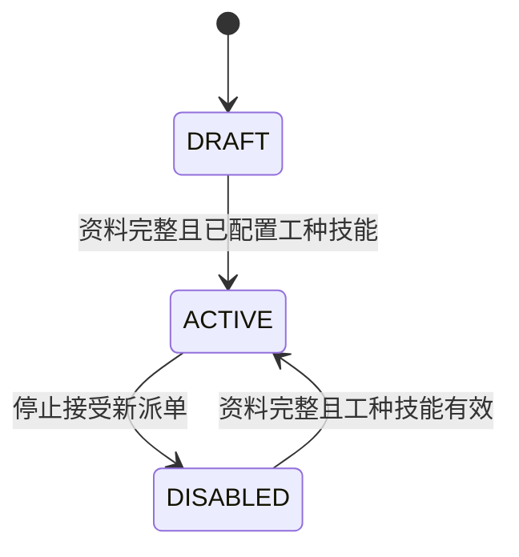

# SPEC-005｜后台师傅管理

**状态：** Draft for review  
**版本：** V1.0  
**日期：** 2026-08-09  
**适用工程：** `apps/server-go`、`apps/admin-web`  
**上游依据：** SPEC-004 订单履约与工单派单链路

---

## 1. 结论

本期在 React 管理后台新增完整的“师傅管理”模块，使运营人员能够：

```text
新增师傅
→ 维护基本资料、工种和技能
→ 启用师傅
→ 派单时按服务所需技能选择可用师傅
→ 查看师傅当前工单负载
→ 编辑或安全禁用师傅
```

本 Spec 只解决后台师傅档案与派单候选管理，不包含微信登录、微信身份绑定、师傅自主入驻、工资提成和智能派单。

## 2. 当前基线与问题

### 2.1 已有能力

- PostgreSQL 已有 `employee_account` 表；
- Go 后端已有极简接口：
  - `GET /api/v1/admin/workers`
  - `POST /api/v1/admin/workers`
  - `POST /api/v1/admin/workers/{id}/status`
- 工单表已有 `assignee_id`；
- 履约调度页派单弹窗已调用启用师傅列表。

### 2.2 当前缺口

- React 后台没有独立师傅管理入口和页面；
- 新增师傅只能写姓名、用户名和手机号，不能查看或编辑详情；
- 没有稳定的师傅编号；
- 没有师傅工种与技能配置，派单无法判断专业能力；
- 没有内部工种和技能字典，运营人员无法快速判断师傅擅长方向；
- 服务 SKU 与所需技能没有关联，派单候选无法按能力匹配；
- 没有备注、入职时间和负载信息；
- 禁用师傅没有完整的未完成工单阻断规则；
- 没有师傅资料变更历史；
- 后端将唯一冲突统一映射成“用户名重复”，错误不准确；
- 当前新增师傅直接进入 `ACTIVE`，缺少保存后再启用的业务控制。

## 3. 目标与成功标准

### 3.1 业务目标

1. 运营人员可以在后台独立完成师傅档案的新增、编辑、查询和启停。
2. 每名师傅至少配置一个工种和一项技能后才能启用。
3. 运营人员可以独立维护工种和技能字典。
4. 派单选择器优先展示满足当前服务所需技能的师傅。
5. 后台能看到师傅当前未完成工单数，避免盲目派单。
6. 停用师傅时不阻塞未来预约单，并为运营提供已有工单处理策略。
7. 所有关键资料和状态变更可追溯。

### 3.2 验收成功标准

- 新增师傅后可在列表和详情中查询；
- 编辑资料使用版本号，冲突时返回 409；
- 无工种或技能的师傅不能启用；
- 已停用工种或技能不能继续分配给新师傅；
- 师傅存在未完成工单时仍可停用，并按所选策略处理已有预约；
- 被禁用师傅不出现在派单候选中；
- 派单候选按 SKU 所需技能进行匹配和排序；
- 跨组织查询或修改师傅失败；
- React lint、build 和 Go test 通过。

## 4. 本期范围

### 4.1 包含

- 后台菜单“师傅管理”；
- 师傅列表、搜索、状态筛选和分页；
- 新增师傅；
- 师傅详情；
- 编辑基本资料；
- 工种字典的新增、编辑、启停和排序；
- 技能字典的新增、编辑、启停和排序；
- 为师傅配置工种与技能；
- 为维修 SKU 配置建议技能要求；
- 启用与禁用；
- 展示未完成工单数和各状态工单数；
- 派单选择器按分类筛选；
- 师傅资料及状态变更历史；
- PostgreSQL migration、Go API、React 页面和测试。

### 4.2 暂不包含

- 微信登录、OpenID、UnionID 和账号绑定；
- 师傅自主注册、审核入驻和邀请二维码；
- 身份证、银行卡、人脸识别和实名认证；
- 技能证书上传及证书到期提醒；
- 多城市、服务半径和地图围栏；
- 班次、请假、日历和预约冲突；
- 抢单、自动派单和智能推荐；
- 评分、投诉、绩效、提成、工资和结算；
- 删除师傅档案。

## 5. 角色与权限

| 角色 | 权限 |
| --- | --- |
| 管理员/调度 | 查询师傅、查看详情、查看负载、作为派单候选使用 |
| 管理员 | 新增、编辑、配置工种技能、启用、停用 |
| 师傅 | 本期无后台访问权限 |

当前本地环境继续使用 Basic Auth。生产 RBAC 不在本期实现，但 Service 层必须保留管理员操作校验，不能只依赖前端隐藏按钮。

## 6. 核心产品决策

### 6.1 客户分类、工种与技能必须分开

- 师傅是履约人员档案；
- 服务分类和 SKU 是面向客户的商品目录；
- 工种是内部人员的粗粒度职业归类，例如水电工、防水工、暖通工、检测工程师；
- 技能是工种下用于派单判断的能力标签，例如暗管测漏、PPR 管维修、卫生间防水、地暖检修；
- 一个工种包含多项技能；
- 一名师傅可以选择多个工种和多项技能；
- 一项技能只属于一个工种；
- SKU 可配置零到多个建议技能，供派单候选匹配；
- 工种和技能属于内部运营字典，不在客户小程序直接展示。

首期技能只表达“是否具备”，不建设熟练度等级、证书有效期和考试体系。

### 6.2 师傅状态

师傅使用三个状态：

| 状态 | 含义 | 可派单 |
| --- | --- | --- |
| `DRAFT` | 档案已创建但资料或工种技能未确认 | 否 |
| `ACTIVE` | 已启用，可参与派单 | 是 |
| `DISABLED` | 离职、停用或暂不接单 | 否 |

状态流转：



不提供删除操作。历史工单始终保留原师傅 ID 和显示名快照。

### 6.3 启用条件

师傅满足以下条件才能进入 `ACTIVE`：

- 姓名合法；
- 手机号合法且组织内不重复；
- 至少绑定一个状态为 `ACTIVE` 的工种；
- 至少绑定一项状态为 `ACTIVE` 且属于已选工种的技能；
- 档案未被逻辑删除。

### 6.4 停用与已有预约工单

师傅状态表达的是“是否允许接受新派单”，不是“是否还能处理已经分配的工单”。

- 师傅可以在存在未完成工单时停用；
- 停用成功后立即从新派单和改派候选中消失；
- 默认策略为 `KEEP_ASSIGNMENTS`：保留已有工单，师傅仍可查看和履约这些已分配工单；
- 可选策略为 `RETURN_NOT_STARTED`：将 `PENDING_ACCEPT`、`PENDING_ARRIVAL` 等尚未到达的工单退回 `PENDING_DISPATCH`；
- `ARRIVED`、`IN_SERVICE`、`WAITING_COMPLETION_REVIEW`、`WAITING_ACCEPTANCE` 等已进入履约环节的工单不自动改派；
- 退回待派必须写工单状态历史和派单历史，原因使用本次停用原因；
- 已完成工单始终展示原师傅信息；
- 停用确认框必须按待接单、待上门、服务中、待审核、待验收展示已有工单数量。

如果师傅离职且需要立即阻止登录，应使用独立的“账号锁定”安全能力；本期业务停用不能切断其处理存量工单的权限。

### 6.5 派单候选

工单通过 `work_order_item → order_item → service_sku` 获取 SKU，再读取该 SKU 配置的建议技能。

派单候选必须同时满足：

- 同一 `org_id`；
- `role='WORKER'`；
- `status='ACTIVE'`；
- 师傅至少命中 SKU 的一项建议技能；
- 不包含当前已被禁用或删除的人员。

候选列表排序规则：

1. 命中全部建议技能；
2. 命中技能数量降序；
3. 未完成工单数升序；
4. 姓名升序。

如果 SKU 没有配置建议技能，候选列表展示所有启用师傅，并明确标记“服务未配置技能要求”。本期只提供辅助排序，不自动选择师傅。

### 6.6 技能字典状态规则

- 工种状态：`ACTIVE`、`DISABLED`；
- 技能状态：`ACTIVE`、`DISABLED`；
- 工种下仍存在启用技能时不能禁用工种；
- 禁用技能不删除师傅既有绑定和历史，只阻止新配置及新派单匹配；
- 已被 SKU 或师傅引用的工种、技能不提供物理删除；
- 未被引用的技能支持删除；已被师傅或 SKU 使用的技能删除失败；
- 工种支持删除，但只有该工种下技能全部删除后才允许删除；删除操作必须在后台二次确认；
- 重新启用后可继续用于配置和派单。

工种编码规则：编码由后端自动生成，格式为 `TR{yyyyMMdd}{sequence}`，创建后只读，前端和请求体不得填写或修改；系统在组织内校验唯一性。
技能编码必须包含所属工种编码，格式为 `{tradeCode}-SK{sequence}`；新增技能时由后端根据所选工种自动生成，前端和请求体不得填写或修改；已有技能编码保持不变。

## 7. 页面与交互

### 7.1 后台菜单

在主导航增加：

```text
师傅管理  /workers
```

位置建议放在“履约调度”之前或之后。

### 7.2 师傅列表

列表字段：

- 师傅编号；
- 姓名；
- 脱敏手机号；
- 工种与技能；
- 状态；
- 未完成工单数；
- 最后更新时间；
- 操作。

筛选能力：

- 关键字：师傅编号、姓名、手机号；
- 状态：全部、草稿、启用、禁用；
- 工种；
- 技能。

操作：

- 查看；
- 编辑；
- 启用；
- 禁用。

### 7.3 新增与编辑

字段：

| 字段 | 必填 | 规则 |
| --- | --- | --- |
| 姓名 `displayName` | 是 | 2—64 字 |
| 手机号 `mobile` | 是 | 中国大陆 11 位手机号，组织内唯一 |
| 师傅编号 `workerNo` | 系统生成 | 创建师傅时由后端自动生成，组织内唯一；前端和请求体不得填写或修改 |
| 工种 `tradeIds` | 启用时必填 | 可多选，只能选择启用工种 |
| 技能 `skillIds` | 启用时必填 | 可多选，必须属于已选工种且为启用状态 |
| 入职日期 `joinedOn` | 否 | `YYYY-MM-DD` |
| 备注 `remark` | 否 | 最长 500 字 |

产品交互：

- “保存草稿”：允许暂时没有分类；
- “保存并启用”：必须满足全部启用条件；
- 师傅编号不允许人工填写或修改，由系统生成后只读展示；
- 用户名不在界面暴露，由系统用师傅编号生成内部账号标识；
- 手机号列表脱敏，详情和编辑页显示完整值。

### 7.4 师傅详情

展示：

- 基本资料；
- 工种与技能标签；
- 当前状态；
- 工单负载统计；
- 最近 20 张工单；
- 资料和状态变更历史。

## 8. 数据模型

### 8.1 `employee_account` 调整

继续作为师傅主档，不新增重复主表。新增：

- `worker_no VARCHAR(32) NULL`；
- `joined_on DATE NULL`；
- `remark VARCHAR(500) NULL`；
- `deleted_at TIMESTAMPTZ(3) NULL`；
- 状态允许 `DRAFT`、`ACTIVE`、`DISABLED`；
- `UNIQUE (org_id, worker_no)`；
- `UNIQUE (org_id, mobile)`，允许 `mobile IS NULL` 时按 PostgreSQL 语义处理。

新建师傅时：

- 默认 `DRAFT`；
- `worker_no` 始终由后端生成 `WK{yyyyMMdd}{sequence}`，生成时在组织内做唯一性校验；
- `username` 使用 `worker_no`；
- `password_hash` 写入随机不可登录值；
- 不创建默认明文密码。

### 8.2 `worker_trade` 新表

字段：`id`、`org_id`、`trade_code`、`name`、`description`、`sort_order`、`status`、`version`、`created_at`、`updated_at`。

约束：

- `UNIQUE (org_id, trade_code)`；编码由系统生成，禁止人工修改；
- `UNIQUE (org_id, name)`；
- 状态只允许 `ACTIVE`、`DISABLED`。

### 8.3 `worker_skill` 新表

字段：`id`、`org_id`、`trade_id`、`skill_code`、`name`、`description`、`sort_order`、`status`、`version`、`created_at`、`updated_at`。

约束：

- `UNIQUE (org_id, skill_code)`；技能编码包含所属工种编码并由系统生成；
- `UNIQUE (org_id, trade_id, name)`；
- 技能必须与工种属于同一组织。

### 8.4 `worker_trade_assignment` 新表

字段：`id`、`org_id`、`worker_id`、`trade_id`、`created_at`。

约束：`UNIQUE (org_id, worker_id, trade_id)`。

### 8.5 `worker_skill_assignment` 新表

| 字段 | 说明 |
| --- | --- |
| `id` | identity 主键 |
| `org_id` | 组织 |
| `worker_id` | 师傅 ID |
| `skill_id` | 技能 ID |
| `created_at` | 创建时间 |

约束：

- `UNIQUE (org_id, worker_id, skill_id)`；
- 师傅、技能及技能所属工种必须属于同一组织；
- 师傅必须同时关联技能所属工种；
- 更新工种和技能采用同一事务，必须与版本更新及历史写入原子提交。

### 8.6 `service_sku_skill_requirement` 新表

字段：`id`、`org_id`、`sku_id`、`skill_id`、`created_at`。

约束：`UNIQUE (org_id, sku_id, skill_id)`。SKU 编辑页保存技能要求时与 SKU 版本更新处于同一事务。

### 8.7 `worker_profile_history` 新表

至少包含：

- `worker_id`；
- `event_code`：`CREATED`、`PROFILE_UPDATED`、`TRADES_UPDATED`、`SKILLS_UPDATED`、`ACTIVATED`、`DISABLED`；
- `operator_type`、`operator_id`、`operator_name`；
- `before_json`、`after_json`；
- `reason`；
- `created_at`。

历史只追加，不提供删除和修改 API。

## 9. API 契约

### 9.1 工种与技能管理

| Method | Path | 用途 |
| --- | --- | --- |
| `GET` | `/api/v1/admin/worker-trades` | 工种列表和筛选 |
| `POST` | `/api/v1/admin/worker-trades` | 新增工种 |
| `PUT` | `/api/v1/admin/worker-trades/{id}` | 编辑工种 |
| `POST` | `/api/v1/admin/worker-trades/{id}/status` | 启用或禁用工种 |
| `DELETE` | `/api/v1/admin/worker-trades/{id}` | 删除无技能的工种 |
| `GET` | `/api/v1/admin/worker-skills` | 按工种、状态、关键字查询技能 |
| `POST` | `/api/v1/admin/worker-skills` | 新增技能 |
| `PUT` | `/api/v1/admin/worker-skills/{id}` | 编辑技能 |
| `POST` | `/api/v1/admin/worker-skills/{id}/status` | 启用或禁用技能 |
| `DELETE` | `/api/v1/admin/worker-skills/{id}` | 删除未被使用的技能 |

后台菜单新增“技能管理”，页面采用左侧工种、右侧技能的主从布局。

### 9.2 师傅管理

| Method | Path | 用途 |
| --- | --- | --- |
| `GET` | `/api/v1/admin/workers` | 分页、搜索、筛选 |
| `POST` | `/api/v1/admin/workers` | 新增草稿或新增并启用 |
| `GET` | `/api/v1/admin/workers/{id}` | 师傅详情、负载和历史 |
| `PUT` | `/api/v1/admin/workers/{id}` | 编辑资料和服务分类 |
| `POST` | `/api/v1/admin/workers/{id}/activate` | 启用 |
| `POST` | `/api/v1/admin/workers/{id}/disable` | 禁用，原因必填 |

列表参数：

```text
keyword
status
tradeId
skillId
page
pageSize
```

新增/编辑请求：

```json
{
  "displayName": "张师傅",
  "mobile": "13800138000",
  "tradeIds": [11],
  "skillIds": [101, 102],
  "joinedOn": "2026-08-09",
  "remark": "擅长测漏和水路维修",
  "activate": true,
  "version": 0
}
```

禁用请求：

```json
{
  "reason": "人员离职",
  "workOrderPolicy": "KEEP_ASSIGNMENTS",
  "version": 3
}
```

`workOrderPolicy`：

- `KEEP_ASSIGNMENTS`：默认，保留全部已有预约；
- `RETURN_NOT_STARTED`：将尚未到达的工单退回待派。

### 9.3 SKU 技能要求

扩展现有 SKU 新增和编辑接口，增加：

```json
{
  "requiredSkillIds": [101, 102]
}
```

后台 SKU 编辑页增加“建议工种与技能”区域。技能仅影响派单匹配，不改变客户看到的服务描述和价格。

### 9.4 派单候选

```http
GET /api/v1/admin/workers/candidates?workOrderId={id}
```

返回：

```json
[
  {
    "id": "101",
    "workerNo": "WK20260809001",
    "displayName": "张师傅",
    "mobileMasked": "138****8000",
    "trades": ["水电工"],
    "skills": ["暗管测漏", "PPR 管维修"],
    "matchedSkills": ["暗管测漏"],
    "matchedSkillCount": 1,
    "requiredSkillCount": 1,
    "openWorkOrderCount": 2,
    "allSkillsMatched": true
  }
]
```

派单接口仍需再次校验候选资格，不能相信前端提交的 `workerId`。

## 10. 业务校验与错误码

| 错误码 | HTTP | 场景 |
| --- | ---: | --- |
| `WORKER_NOT_FOUND` | 404 | 师傅不存在或跨组织不可见 |
| `WORKER_NO_EXISTS` | 409 | 师傅编号重复 |
| `WORKER_MOBILE_EXISTS` | 409 | 手机号重复 |
| `WORKER_STATUS_CONFLICT` | 409 | 当前状态不允许操作 |
| `WORKER_TRADE_REQUIRED` | 400 | 启用时没有工种 |
| `WORKER_SKILL_REQUIRED` | 400 | 启用时没有技能 |
| `WORKER_TRADE_INVALID` | 400 | 工种不存在、已禁用或跨组织 |
| `WORKER_SKILL_INVALID` | 400 | 技能不存在、已禁用、跨组织或不属于已选工种 |
| `TRADE_HAS_ACTIVE_SKILLS` | 409 | 工种下存在启用技能，不能禁用 |
| `TRADE_NAME_EXISTS` | 409 | 工种名称重复 |
| `SKILL_NAME_EXISTS` | 409 | 同一工种下技能名称重复 |
| `TRADE_HAS_SKILLS` | 409 | 工种下仍有技能，不能删除工种 |
| `TRADE_IN_USE` | 409 | 工种已被师傅绑定，不能删除工种 |
| `SKILL_IN_USE` | 409 | 技能已被师傅或 SKU 使用，不能删除 |
| `WORKER_DISABLE_POLICY_CONFLICT` | 409 | 请求退回的工单已进入不可自动退回状态 |
| `RESOURCE_VERSION_CONFLICT` | 409 | 编辑版本冲突 |
| `VALIDATION_ERROR` | 400 | 字段格式错误 |

手机号、地址和内部备注不得写入结构化日志。

## 11. 并发与事务

- 编辑、启用、禁用必须携带 `version`；
- 更新使用 `WHERE id=? AND version=?` 乐观锁；
- 资料修改、工种技能更新、版本增加和历史写入在同一事务；
- 停用时锁定师傅记录，将状态更新、可选的工单退回、工单历史、派单历史和师傅历史放在同一事务；
- 停用与新派单并发时，以师傅状态条件更新为准：停用事务提交后不得再产生新派单；
- 派单事务需要锁定或带条件检查师傅仍为 `ACTIVE` 且技能仍匹配。

## 12. 测试场景

### 12.1 后端

1. 新增草稿成功并生成唯一师傅编号。
2. 重复手机号和编号返回准确错误码。
3. 无工种或无技能执行启用失败。
4. 绑定启用工种和技能后启用成功。
5. 已禁用师傅不在候选列表。
6. 技能不匹配师傅排在匹配师傅之后或按严格筛选不展示。
7. 存在未来预约工单时使用 `KEEP_ASSIGNMENTS` 停用成功，原师傅仍可履约存量工单。
8. 使用 `RETURN_NOT_STARTED` 时，待接和待上门工单退回待派，服务中工单保持不变。
9. 两个管理员持同一版本编辑时只有一个成功。
10. 跨组织查询和修改返回 404。
11. 工种下存在启用技能时禁用工种失败。
12. 停用技能不能分配给新师傅或配置给 SKU。

### 12.2 React

1. 列表搜索、状态、工种和技能筛选正确。
2. 新增草稿与保存并启用行为正确。
3. 表单校验与后端错误可读。
4. 停用弹窗展示已有工单分组，并允许选择“保留预约”或“退回未开始工单”。
5. 派单弹窗只显示当前工单的有效候选。
6. 409 后刷新详情，不覆盖他人修改。
7. 技能管理页能完成工种和技能的新增、编辑、启停。
8. SKU 编辑页能配置建议技能。

## 13. 验收标准

### AC-WRK-01｜新增草稿

Given 管理员填写合法姓名和手机号  
When 保存草稿  
Then 系统生成师傅编号，状态为 `DRAFT`，列表和详情可见。

### AC-WRK-02｜配置工种技能并启用

Given 草稿师傅至少绑定一个启用工种及其技能  
When 管理员启用  
Then 状态变为 `ACTIVE` 并写入历史。

### AC-WRK-03｜启用校验

Given 师傅没有工种、没有技能或手机号重复  
When 管理员尝试启用  
Then 操作失败且返回明确错误码。

### AC-WRK-04｜派单候选

Given 待派工单对应 SKU 要求技能 A  
When 后台打开派单选择器  
Then 优先显示启用且具备技能 A 的师傅，并展示命中技能和未完成工单数。

### AC-WRK-05｜编辑并发

Given 两个管理员持有同一版本  
When 同时编辑  
Then 仅一个成功，另一个获得 `RESOURCE_VERSION_CONFLICT`。

### AC-WRK-06｜安全禁用

Given 师傅存在未来预约工单  
When 管理员选择“保留已有预约”并停用  
Then 师傅退出新派单候选，但仍能完成已分配工单。

### AC-WRK-07｜禁用后派单保护

Given 师傅已禁用  
When 查询候选或直接提交该师傅 ID 派单  
Then 候选不包含该师傅，直接派单返回 `WORKER_DISABLED`。

### AC-WRK-08｜可追溯

Given 师傅经历新增、技能调整、启用和停用  
When 查看详情  
Then 后台可看到完整操作人、时间、前后内容和原因。

### AC-WRK-09｜技能字典

Given 管理员创建工种“水电工”及技能“暗管测漏”  
When 在师傅编辑页选择  
Then 技能按工种分组展示并可保存；停用后不能用于新配置。

### AC-WRK-10｜SKU 技能匹配

Given SKU 配置建议技能“暗管测漏”  
When 调度打开该 SKU 对应工单的派单弹窗  
Then 候选列表展示师傅技能命中情况，并按匹配度和负载排序。

## 14. Definition of Done

- AC-WRK-01 至 AC-WRK-10 全部通过；
- PostgreSQL migration 可从当前 V2 向前执行；
- Go test、vet、build 通过；
- React lint、typecheck、build 通过；
- 真实 PostgreSQL 上编辑并发和禁用/派单竞争测试通过；
- 后台能维护工种技能、新增师傅、配置技能、启用并成功派发匹配工单；
- 禁用师傅无法再被派单；
- OpenAPI 和本地验证文档同步更新。

## 15. 与现有实现的迁移关系

- 保留现有 `employee_account` 数据；
- 存量 `ACTIVE` 师傅迁移为 `DRAFT`，待管理员补齐手机号、工种和技能后重新启用；
- 开发环境可保留 `local-worker-{id}` Token，仅用于师傅端履约联调；
- 当前 `/admin/workers/{id}/status` 在新接口上线后废弃，由 `/activate` 和 `/disable` 显式命令替代；
- 当前派单页调用的通用启用师傅列表改为 `workers/candidates?workOrderId=`；
- 本 Spec 不改变工单状态机和客户验收流程。
