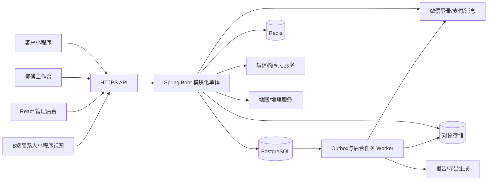
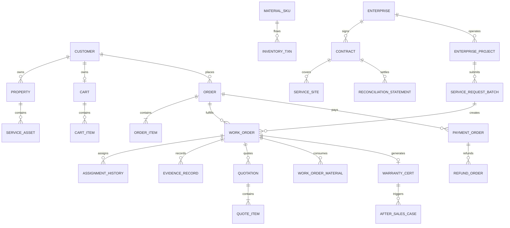
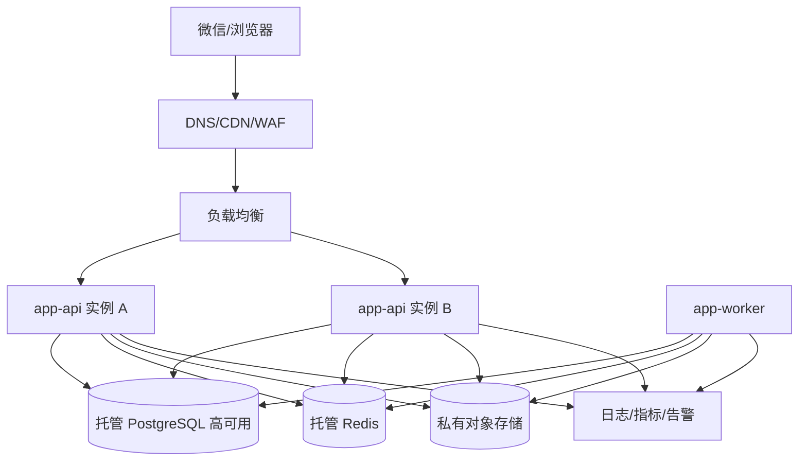

# 县域家居水电运维平台｜技术方案 V1.3

> 面向服务电商微信小程序、师傅工作台与 React 管理后台的生产级技术设计。V1.1 新增分类、搜索、购物车、多诉求订单拆单，并将物业/企业合同项目、批量工单、SLA 与对账前置为一期核心。

**方案状态：** 开发基线讨论稿  
**上游文档：** `docs/产品方案-V1.md`  
**后端基线：** Java LTS + Spring Boot 3  
**管理后台：** React + TypeScript + Vite + Ant Design  
**微信小程序：** 微信原生小程序 + TypeScript  
**架构策略：** 模块化单体优先，事务一致性优先，按业务压力渐进拆分

**V1.3 目录补充：** `catalog` 模块统一维护分类和 SKU。分类支持父级、客户端名称、排序、启停与在售 SKU 计数；管理后台通过分类 CRUD API 维护，小程序通过公共分类目录 API 获取，SKU 表单只读取启用分类。TabBar 只承担“首页、全部服务、我的”，购物车保持服务端状态并通过页面内入口访问，不与导航结构耦合。

---

## 1. 技术结论

### 1.1 推荐架构

V1 采用“**模块化单体 + 独立后台任务 + 托管基础设施**”，不采用微服务。后端以一个 Spring Boot 应用部署，但代码、数据库表、事务入口和领域事件按模块隔离。

这样做的原因：

- 创业初期研发人员少，核心矛盾是快速验证业务闭环，不是跨团队治理；
- 订单、报价、支付、库存、施工证据之间存在大量强事务关系，单体事务更可靠；
- 微服务会提前引入服务发现、链路追踪、分布式事务、消息一致性和发布编排成本；
- 模块边界、Outbox 事件和对象存储设计得当，未来仍可拆出媒体、通知、支付、报表等服务。

### 1.2 技术目标

1. 支撑分类/搜索/购物车、多订单项、订单拆工单，以及散户标准单、勘察报价单、复杂工程单和 B 端合同工单。
2. 保证支付、报价、库存、工单状态的幂等与可追溯。
3. 施工影像只追加、不覆盖，形成可审计的证据链。
4. 所有高危操作可追责，客户与员工数据按最小权限访问。
5. 单人或小团队可以开发、部署、排障，不依赖复杂平台团队。
6. 先支撑单城 3–50 名作业人员和一个约 10 万元级企业维保标杆项目，架构上可平滑扩展到多项目、多网点和多城市。

### 1.3 容量基线

V1 可按以下保守容量设计，不需要过早做超大规模优化：

当前将用户表述的“企业 10 万单”按“合同金额约 10 万元级的单个企业维修/维保项目”理解。如果实际含义是 10 万张维修工单，则现有容量基线和人工调度模式不成立，需要单独进行容量压测、分区、异步化、批处理与组织配置评估。

| 指标 | V1 设计基线 | 说明 |
|---|---:|---|
| 注册客户 | 10 万 | 单城长期累积量级 |
| 日订单 | 2,000 单 | 显著高于初期真实业务量 |
| 单订单服务项 | 20 项 | 覆盖家庭多诉求与企业批量报修，超出走批量任务入口 |
| 单企业项目工单 | 10 万条长期上限 | 数据模型预留；一期按真实项目规模压测 |
| 峰值 API | 200 RPS | 活动、支付回调与后台并发叠加 |
| 日新增图片 | 5 万张 | 每单多节点、多图片 |
| 在线员工 | 500 | 为后续多网点预留 |
| 核心接口可用性 | 99.9% | 不含微信、短信等外部依赖故障 |
| 核心 API P95 | 500ms 内 | 不含文件上传、报表导出 |

容量基线不是营销承诺。上线后以真实监控数据调整实例、连接池、索引和对象存储策略。

---

## 2. 技术选型

### 2.1 后端

| 层级 | 选型 | 使用原则 |
|---|---|---|
| 语言与运行时 | 当前受支持的 Java LTS | 统一生产运行时，不追逐非 LTS 版本 |
| 核心框架 | Spring Boot 3 | 模块化单体、自动配置、成熟生态 |
| Web | Spring MVC | 当前业务以同步事务 API 为主，无需全栈响应式 |
| 安全 | Spring Security | 登录态、RBAC、接口鉴权、管理后台会话 |
| 数据访问 | MyBatis + MyBatis-Plus | 简单 CRUD 提效，复杂查询显式 SQL，避免隐藏 N+1 |
| 数据库迁移 | Flyway | DDL、索引、初始化配置全部版本化 |
| 参数校验 | Jakarta Validation | DTO 边界校验，不在 Controller 手写重复判断 |
| 接口描述 | OpenAPI | 生成管理后台/小程序客户端类型和联调文档 |
| JSON | Jackson | 金额、日期、枚举采用统一序列化规则 |
| 测试 | JUnit 5、Mockito、Testcontainers | 领域单测、数据库集成测试、外部依赖契约测试 |
| 构建 | Maven 或 Gradle 二选一 | 建议使用团队最熟悉者；全文示例以 Maven 表达 |

不建议 V1 同时引入 JPA 和 MyBatis。数据访问风格越少，事务和 SQL 性能越容易判断。

### 2.2 前端

#### React 管理后台

- React + TypeScript + Vite；
- React Router 管理路由；
- Ant Design 作为基础组件体系；
- TanStack Query 管理服务端状态和缓存；
- Zustand 或 Redux Toolkit 仅承载登录态、权限、布局等少量客户端状态；
- React Hook Form + Schema 校验管理复杂表单；
- OpenAPI 生成请求类型，禁止手工维护重复 DTO；
- ECharts 用于经营看板，首版不做自研图表组件。

#### 微信小程序

- 微信原生小程序 + TypeScript；
- 客户端和师傅工作台在同一小程序中按角色显示；
- 原生能力优先用于登录、手机号授权、支付、订阅消息、定位、相机、扫码和文件上传；
- 业务请求层、错误码、埋点、权限和设计 Token 统一封装；
- 不在 V1 引入跨端框架，避免现场拍照、定位、支付与版本兼容问题被框架放大。

### 2.3 数据与基础设施

| 能力 | 选型 | 备注 |
|---|---|---|
| 关系数据库 | PostgreSQL 18 | 核心交易、工单、库存和审计数据 |
| 缓存 | Redis | 会话、短期缓存、限流、分布式锁；不作为唯一真相源 |
| 文件 | 腾讯云 COS/兼容 S3 的对象存储 | 施工原图、缩略图、服务报告、导出文件 |
| CDN | 对象存储 CDN | 仅公开素材；客户施工影像使用鉴权访问 |
| 异步任务 | 数据库任务表 + Outbox Worker | V1 保持轻量；吞吐上升后接入 RocketMQ/Kafka |
| 定时任务 | Spring Scheduler/Quartz 二选一 | 单实例调度或数据库锁，避免重复执行 |
| 监控 | Prometheus 指标体系 + 日志平台 | 可先使用云监控和结构化日志降低运维成本 |
| 链路标识 | Trace ID + Request ID | 全链路日志、错误响应和外部回调统一关联 |

### 2.4 暂不采用的技术

- 微服务、Service Mesh、Kubernetes：V1 成本高于收益；
- Elasticsearch：客户/订单检索先使用 PostgreSQL 组合索引；
- 全量事件溯源：只对状态历史、金额、库存、审计做不可变流水；
- 分布式事务框架：使用本地事务 + Outbox + 幂等消费者；
- 数据湖、实时数仓：经营看板先使用业务库只读查询和汇总表。

---

## 3. 总体架构

### 3.1 逻辑架构



### 3.2 部署单元

V1 建议只有两个可执行部署单元：

1. `app-api`：处理客户端、师傅端、管理后台 API 以及微信支付回调。
2. `app-worker`：复用相同代码包，以不同 Spring Profile 启动，处理 Outbox、通知、提醒、图片派生、报表和补偿任务。

二者共享 PostgreSQL、Redis 和对象存储。这样既避免异步任务阻塞在线请求，也不引入服务间远程调用。

### 3.3 请求链路

1. 客户端携带访问令牌、设备标识和请求 ID 调用 API。
2. 网关/负载均衡完成 HTTPS、基础限流和请求大小限制。
3. Spring Security 恢复当前主体、组织、角色与数据范围。
4. Controller 只完成协议转换和参数校验。
5. Application Service 执行业务用例并开启事务。
6. Domain Service/Policy 执行状态转换、价格和权限规则。
7. Repository 通过 MyBatis 落库，同时写入状态历史、审计和 Outbox。
8. 事务提交后 Worker 异步发送消息、生成报告或同步外部系统。

---

## 4. 代码组织与模块边界

### 4.1 仓库结构

建议单仓库管理，前后端独立构建：

```text
fix-pro/
├─ apps/
│  ├─ server/                 # Spring Boot 后端
│  ├─ admin-web/              # React 管理后台
│  └─ wechat-mini/            # 微信原生小程序
├─ packages/
│  ├─ api-client/             # OpenAPI 生成的 TS 客户端
│  ├─ eslint-config/
│  └─ design-tokens/
├─ deploy/
│  ├─ docker/
│  ├─ compose/
│  └─ scripts/
├─ docs/
│  ├─ adr/                    # 架构决策记录
│  ├─ api/
│  └─ runbooks/               # 发布、回滚、故障处理手册
└─ README.md
```

Java 后端建议按业务模块组织，而不是按 Controller/Service/Mapper 横向铺满整个工程：

```text
com.fixpro
├─ boot
├─ shared
│  ├─ security
│  ├─ web
│  ├─ persistence
│  ├─ idempotency
│  ├─ audit
│  └─ outbox
├─ identity
├─ customer
├─ catalog
├─ search
├─ cart
├─ order
├─ workorder
├─ quotation
├─ payment
├─ evidence
├─ inventory
├─ warranty
├─ aftersales
├─ enterprise
├─ marketing
├─ notification
└─ reporting
```

每个业务模块内部推荐：

```text
module/
├─ api/             # Controller、Request、Response
├─ application/     # 用例服务、事务入口、Command/Query
├─ domain/          # 聚合、值对象、领域策略、领域事件
└─ infrastructure/  # Mapper、DO、Repository、外部适配器
```

### 4.2 模块职责

| 模块 | 负责 | 不负责 |
|---|---|---|
| identity | 微信身份、员工账号、角色、权限、会话 | 客户业务档案 |
| customer | 客户、家庭成员、房屋、设备/服务资产 | 登录认证 |
| catalog | 分类、SPU/SKU、规格、价格、区域、媒体、发布版本、SOP、质保规则 | 具体订单成交价 |
| search | 服务搜索文档、同义词、热词、结果排序 | 商品主数据写入 |
| cart | 购物车、购物车项、失效校验、地址分组、结算预览 | 最终成交订单 |
| order | 多订单项、结算快照、拆工单计划、预约、取消、渠道归因 | 现场履约步骤 |
| workorder | 派单、签到、施工、状态流转、验收 | 支付账务 |
| quotation | 勘察报价、增项、报价版本、客户确认 | 收款回调 |
| payment | 应收、支付单、回调、退款、支付对账 | 业务价格计算 |
| evidence | 上传凭证、影像节点、哈希、可见范围、归档 | 工单状态决策 |
| inventory | 材料、批次、库存流水、备料、出退料 | 完整采购财务 |
| warranty | 质保规则实例化、电子质保凭证 | 售后责任判定 |
| aftersales | 售后申请、责任判定、返修工单 | 原单重写 |
| enterprise | 企业、项目、合同、点位、任务包、SLA、授信、阶段验收、对账 | 财务总账 |
| marketing | 优惠券、次卡、渠道、转介绍 | 广告平台投放管理 |
| notification | 站内消息、微信订阅消息、短信 | 业务事务决策 |
| reporting | 指标汇总、看板、导出 | 在线交易写入 |

### 4.3 模块调用规则

- Controller 不跨模块直接访问 Mapper。
- 一个用例只有一个主事务模块；跨模块通过明确的 Application Facade 或领域事件协作。
- 禁止多个模块共同修改同一张表。
- 查询型页面可以通过专门 Query Mapper 做只读联表，但不能借查询对象反向更新业务数据。
- 外部系统均通过 Adapter 隔离，领域代码不能直接依赖微信、COS 或短信 SDK。

---

## 5. 身份、认证与权限

### 5.1 身份模型

统一主体 `principal`，但区分登录身份：

- 微信客户：`customer_identity`，以微信开放标识关联客户；
- 师傅/员工：`employee_account`，可绑定微信身份和后台账号；
- B 端联系人：`enterprise_contact_identity`；
- 管理员：员工账号的一种角色，不建立独立用户体系。

同一个自然人可以同时是客户与员工，但权限上下文必须明确切换，不能因绑定同一手机号自动合并权限。

### 5.2 登录方案

#### 小程序

1. 小程序调用微信登录能力取得一次性凭证。
2. 后端调用微信服务换取会话标识，禁止把应用密钥放到小程序。
3. 后端查找/创建微信身份，签发短期 Access Token 和可撤销 Refresh Token。
4. 手机号授权单独完成，并记录授权时间、来源和用途。
5. 师傅进入工作台前校验员工状态、班组、资质和角色。

#### React 管理后台

- 员工账号 + 密码登录；生产建议增加短信/OTP 二次验证；
- Access Token 短时有效，Refresh Token 采用 HttpOnly、Secure Cookie；
- 管理后台不把长期令牌存入 LocalStorage；
- 连续失败、异地登录和高危操作触发风控或二次验证。

### 5.3 授权模型

采用 `RBAC + Data Scope + Resource Policy`：

- RBAC：角色拥有菜单和动作权限，如 `workorder:dispatch`、`quote:approve`；
- Data Scope：本人、班组、网点、指定企业项目、全部组织；
- Resource Policy：只有当前工单师傅能上传证据，只有指定验收人能验收 B 端工单；
- 字段权限：手机号、完整地址、成本、毛利等敏感字段按岗位脱敏；
- 临时授权：改派、代验收、超授信放行要有截止时间和审批记录。

后端是最终权限边界，React 菜单隐藏和小程序按钮隐藏只改善体验，不能替代服务端鉴权。

---

## 6. 数据设计规范

### 6.1 通用字段

核心业务表统一包含：

- `id BIGINT UNSIGNED`：应用生成的分布式 ID；JSON 中序列化为字符串，避免 JavaScript 精度丢失；
- `org_id BIGINT UNSIGNED`：组织隔离字段，V1 即写入，暂不开放多租户；
- `created_at / updated_at DATETIME(3)`：数据库统一 UTC，展示转换为 Asia/Shanghai；
- `created_by / updated_by BIGINT`：操作主体；
- `version INT`：需要并发保护的聚合使用乐观锁；
- `deleted_at`：仅主数据允许软删除，交易流水不允许物理删除。

金额使用 `BIGINT` 分存储，数量使用明确精度的 `DECIMAL`。禁止用浮点数存金额。枚举在数据库中存稳定代码，不存中文展示文本。

### 6.2 数据不可变原则

- 报价确认后不覆盖，创建新版本或变更单；
- 支付、退款、库存、状态、审计均使用追加流水；
- 施工原图对象不覆盖，作废只改变可用状态并保留原因；
- 客户验收、签字和授权保留快照，不能依赖用户后续修改后的姓名或手机号；
- 服务 SKU 修改后，历史订单仍读取下单快照。

### 6.3 核心实体关系



### 6.4 核心表

#### 客户与资产

| 表 | 关键字段 | 说明 |
|---|---|---|
| `customer` | name、mobile_cipher、mobile_hash、source_channel | 客户主档，手机号密文与检索哈希分离 |
| `customer_identity` | customer_id、provider、openid、unionid | 微信等外部身份 |
| `property` | customer_id、community、address_cipher、geo_point | 房屋档案 |
| `property_member` | property_id、customer_id、relation、permission | 家庭成员授权 |
| `service_asset` | property_id、asset_type、brand、model、installed_at | 家电、净水、暖气、管路等服务资产 |

#### 商品、订单与履约

| 表 | 关键字段 | 说明 |
|---|---|---|
| `service_category` | parent_id、name、sort | 服务类目树 |
| `service_product` | category_id、title、subtitle、status、brand_content | 服务 SPU 与图文内容 |
| `service_sku` | product_id、sku_code、price_mode、unit、status | 可交易维修规格主记录 |
| `service_sku_draft` | sku_id、draft_payload、workflow_status、base_version | 后台编辑草稿与审核载体 |
| `service_sku_version` | sku_id、version_no、full_snapshot、published_at、publisher_id | 不可变发布版本与历史订单快照来源 |
| `service_sku_region` | sku_version_id、region_code、sellable、price_override | 发布版本的可售区域与区域价 |
| `service_sku_media` | sku_version_id、media_id、type、sort | 主图、详情图、案例媒体 |
| `service_sku_skill` | sku_version_id、skill_code、level | 履约技能要求 |
| `service_search_document` | sku_id、title、keywords、symptoms、category_path、status | 服务搜索读模型，承载同义词与故障词 |
| `search_synonym` | term、normalized_term、status | 跳闸/断电、漏水/渗水等运营词典 |
| `shopping_cart` | customer_id、selected_property_id、version、expires_at | 每客户活动购物车，乐观锁保护 |
| `shopping_cart_item` | cart_id、sku_id、sku_version、quantity、item_payload、selected | 规格、设备、故障、图片草稿与预约约束 |
| `customer_order` | order_no、customer_id、property_id、type、status、amounts | 交易订单 |
| `order_item` | sku_id、sku_snapshot、quantity、price、fulfillment_group_key | 订单项及拆单分组依据 |
| `order_fulfillment_plan` | order_id、plan_version、split_reason、status | 订单项到工单的可审计拆分计划 |
| `work_order_item` | work_order_id、order_item_id、quantity、scope_snapshot | 工单实际履约的订单项范围 |
| `appointment` | order_id、time_window、contact_snapshot | 预约信息 |
| `work_order` | work_order_no、order_id、service_type、status、priority、sla_at | 履约主单 |
| `work_order_assignee` | work_order_id、employee_id、role、active | 当前作业人员 |
| `assignment_history` | from_employee、to_employee、reason | 派单/改派历史 |
| `work_order_status_history` | from_status、to_status、event、operator | 状态不可变流水 |
| `checklist_result` | work_order_id、sop_item_id、value、result | SOP 检查结果 |
| `acceptance_record` | work_order_id、acceptor_snapshot、method、accepted_at | 验收快照 |

#### 报价、支付与售后

| 表 | 关键字段 | 说明 |
|---|---|---|
| `quotation` | work_order_id、version_no、status、total_amount、expires_at | 报价版本 |
| `quote_item` | quotation_id、type、reference_id、description、amount | 服务、工时、材料、附加项、折扣 |
| `change_order` | quotation_id、reason、delta_amount、status | 已开工后的正式变更 |
| `receivable` | order_id、stage、due_amount、paid_amount、status | 定金、尾款或账期应收 |
| `payment_order` | payment_no、receivable_id、channel、amount、status | 内部支付单 |
| `payment_transaction` | payment_id、channel_trade_no、raw_digest、status | 渠道交易与回调流水 |
| `refund_order` | refund_no、payment_id、amount、reason、status | 退款单 |
| `warranty_certificate` | order_id、work_order_id、scope_snapshot、start_at、end_at | 电子质保 |
| `after_sales_case` | warranty_id、type、responsibility、status | 售后/返修案件 |

#### 影像、材料与 B 端

| 表 | 关键字段 | 说明 |
|---|---|---|
| `media_asset` | object_key、sha256、mime、size、width、height、status | 文件元数据，不存二进制 |
| `evidence_record` | work_order_id、stage、media_id、visibility、captured_at、geo | 影像与工单证据节点 |
| `material_sku` | brand、model、spec、unit、warranty_rule | 材料主数据 |
| `material_batch` | sku_id、batch_no、supplier_id、received_at | 批次/序列追踪 |
| `inventory_txn` | warehouse_id、sku_id、batch_id、type、quantity、biz_ref | 库存不可变流水 |
| `work_order_material` | work_order_id、sku_id、batch_id、planned_qty、actual_qty | 工单计划与实际用料 |
| `enterprise` | name、credit_limit、status | 企业客户 |
| `enterprise_project` | enterprise_id、name、budget_amount、manager_id、status | 约 10 万元级等企业项目主档 |
| `contract` | enterprise_id、project_id、billing_mode、term、sla_policy、credit_policy | 合同快照 |
| `service_site` | contract_id、name、address、contacts | 项目/点位 |
| `service_request_batch` | project_id、source、batch_no、item_count、status | 多点位/多诉求批量报修批次 |
| `service_request_item` | batch_id、site_id、category、description、priority、attachments | 批量报修明细，校验后生成工单 |
| `project_budget_txn` | project_id、type、amount、biz_ref、occurred_at | 预算占用、释放、确认的不可变流水 |
| `stage_acceptance` | project_id、stage_no、scope_snapshot、amount、status | 企业项目阶段验收 |
| `reconciliation_statement` | contract_id、period、amount、status、due_at | 周期对账与应收 |

#### 平台基础表

- `idempotency_record`：客户端请求和外部回调幂等；
- `outbox_event`：事务内事件；
- `background_job`：可重试后台任务；
- `audit_log`：高危操作与敏感数据访问；
- `notification` / `notification_delivery`：站内消息和渠道投递；
- `operation_lock`：确有需要时的短期业务锁，不替代数据库事务。

### 6.5 索引原则

- 所有列表查询先定义访问路径，再建组合索引；
- 订单常用索引：`(org_id, customer_id, created_at)`、`(org_id, status, created_at)`、`order_no UNIQUE`；
- 工单常用索引：`(org_id, assignee_id, status, appointment_at)`、`(org_id, status, sla_at)`；
- 服务搜索 V1 使用 PostgreSQL `ILIKE` 与组合索引；中文分词效果达不到验收标准时再引入 OpenSearch/Elasticsearch，不在首版预置重型集群；
- 购物车按 `(org_id, customer_id)` 唯一，购物车项使用 `(cart_id, sku_id, item_key)` 去重；
- 企业批量明细按 `(project_id, batch_id, status)`、`(site_id, created_at)` 建索引，导入采用分批校验与异步生成工单；
- 支付渠道单号、退款渠道单号、Outbox 唯一事件键必须唯一；
- 低选择性字段不要单独建索引；
- `%keyword%` 模糊检索不进入核心大表热路径，需要搜索时使用手机号哈希、单号前缀或独立搜索字段；
- 通过慢查询和执行计划验证索引，不按“可能有用”盲目添加。

### 6.6 SKU 主数据、发布与端侧一致性

#### 单一事实来源

`catalog` 模块是维修服务分类、SPU、SKU、规格、价格模式、区域、SOP、证据模板和质保规则的唯一写入方。微信小程序、React 其他业务页面、客服建单和企业模块只能通过 Catalog Query/API 读取，不允许维护本地 SKU 配置表或在前端代码中写死 SKU ID。

#### 草稿与发布模型

1. 后台编辑写入 `service_sku_draft`，草稿可多次保存，不影响线上数据。
2. 提交审核时执行完整校验：分类、唯一编码、规格、价格、可售区域、预约规则、技能、SOP、证据、验收和质保。
3. 审核通过后在一个事务中创建递增的 `service_sku_version`、更新 SKU 当前版本指针并写 Outbox 事件。
4. Worker 消费 `SkuPublished`，刷新目录读模型、搜索文档、缓存和运营预览；事件处理必须幂等。
5. 小程序接口只返回 `PUBLISHED` 且在当前区域/时间有效的版本，并携带 `skuVersion`、`catalogVersion` 和缓存 ETag。
6. 订单结算基于版本重新定价并保存完整 SKU 快照；任何前端传入的价格、名称和质保均不作为可信数据。

#### 变更影响

- 图文或搜索词变更：发布新版本，刷新目录与搜索缓存；
- 价格、区域或预约规则变更：发布新版本，同时使相关购物车项进入待重新确认状态；
- SOP、证据或质保变更：只影响新生成工单，已确认订单继续引用旧快照；
- 下架：禁止新加购和结算，现有订单、工单和售后仍可读取历史版本；
- 删除：仅允许从未发布且无引用的草稿，其他情况使用停用或归档。

#### 缓存策略

- 分类树、SKU 列表和详情使用 Redis + HTTP ETag 缓存，Key 包含组织、区域、语言和目录版本；
- 发布后通过 Outbox 失效相关 Key，不使用超长 TTL 掩盖发布延迟；
- 小程序可缓存最近一次目录用于浏览，但创建订单始终调用服务端结算校验，离线或过期目录不能成交；
- 搜索索引与主库允许短暂最终一致，详情和结算必须回源当前发布版本。

---

## 7. 状态机设计

### 7.1 原则

- 状态转换由领域服务统一执行，禁止 Controller 或 Mapper 直接改 `status`；
- 每次转换校验当前状态、权限、前置条件和版本号；
- 转换与历史流水、Outbox 事件在同一数据库事务中提交；
- API 返回状态码和允许动作，前端不自行推导复杂业务规则；
- 逆向转换必须通过业务事件，如“改派”“取消”“暂停”，不能任意回退。

### 7.2 订单状态

```text
CREATED
  -> WAITING_PAYMENT
  -> CONFIRMED
  -> FULFILLING
  -> WAITING_FINAL_PAYMENT
  -> COMPLETED
  -> CLOSED

任意允许节点 -> CANCELLED
支付后取消   -> REFUNDING -> CANCELLED
```

订单表示交易关系，不能承载所有现场细节。一个复杂订单可拆为多个工单。

订单确认前，结算服务先对购物车执行一次不可变快照：重新校验 SKU 状态、价格版本、服务地址、预约约束和优惠，生成订单、订单项、应收与初始拆单计划。购物车不是订单事实来源，订单创建后即使购物车变化也不得回写订单。

### 7.2.1 购物车状态与拆单规则

- 购物车项状态：`VALID / PRICE_CHANGED / OFF_SHELF / OUT_OF_SERVICE_AREA / APPOINTMENT_CONFLICT`；
- 结算只接受全部选中项为 `VALID`，价格变化必须由客户再次确认；
- 拆单键至少包含服务地址、技能组、价格模式、预约窗口、企业项目/合同和特殊安全要求；
- 一个订单项默认只归属一个工单；需分批履约时通过 `work_order_item` 拆数量并保留总量校验；
- 拆单结果改变必须生成新计划版本和原因，不能静默重排已派工任务。

### 7.3 工单状态

```text
PENDING_DISPATCH
  -> PENDING_ACCEPT
  -> PENDING_ARRIVAL
  -> IN_SERVICE
  -> WAITING_QUOTE_CONFIRMATION  # 可选分支
  -> IN_SERVICE
  -> WAITING_COMPLETION_REVIEW
  -> WAITING_ACCEPTANCE
  -> FINISHED
  -> ARCHIVED
```

异常状态/标记：`RESCHEDULED`、`REASSIGN_REQUIRED`、`SUSPENDED`、`DISPUTED`、`AFTER_SALES`。建议将部分异常做独立字段或案件对象，不要让一个状态枚举承担所有正交维度。

### 7.4 报价状态

`DRAFT -> PENDING_REVIEW -> PENDING_CUSTOMER -> ACCEPTED / REJECTED / EXPIRED / VOID`

- 低于阈值的标准增项可跳过内部审核；
- 客户接受后报价不可编辑；
- 修改内容创建新版本，旧版本转为 `SUPERSEDED`；
- 报价接受与应收创建在同一事务中完成。

### 7.5 支付状态

内部支付单：`CREATED -> PREPAY_READY -> PAYING -> SUCCEEDED / FAILED / CLOSED`。

不得只依赖客户端“支付成功”结果。支付最终状态以服务端验签回调或主动查单为准。重复回调必须返回成功但不得重复入账。

### 7.6 售后状态

`SUBMITTED -> TRIAGED -> WAITING_INSPECTION -> RESPONSIBILITY_DECIDED -> PROCESSING -> WAITING_CONFIRMATION -> RESOLVED / REJECTED / DISPUTED`

售后生成新的返修工单，原工单保持历史事实不变。

---

## 8. API 设计

### 8.1 风格

- 外部 API 使用 HTTPS + JSON；
- 路径版本：`/api/v1/...`；
- 资源名使用复数名词，动作型状态转换使用显式子资源或命令；
- 写操作支持 `Idempotency-Key`；
- 分页采用游标或稳定排序的页码分页，后台大列表优先游标；
- 所有时间使用 ISO 8601 并带时区；
- 金额返回整数分和独立币种，不返回浮点金额；
- Bigint ID 在 JSON 中返回字符串。

统一响应：

```json
{
  "code": "OK",
  "message": "success",
  "data": {},
  "requestId": "01J..."
}
```

错误响应应提供稳定错误码，例如：

- `ORDER_STATUS_CONFLICT`
- `QUOTE_ALREADY_ACCEPTED`
- `PAYMENT_AMOUNT_MISMATCH`
- `EVIDENCE_REQUIRED`
- `INVENTORY_INSUFFICIENT`
- `CONTRACT_CREDIT_EXCEEDED`
- `RESOURCE_VERSION_CONFLICT`

### 8.2 客户端核心接口

| 方法 | 路径 | 说明 |
|---|---|---|
| POST | `/mini/auth/wechat/login` | 微信登录换取平台会话 |
| POST | `/mini/auth/phone/bind` | 绑定授权手机号 |
| GET | `/catalog/services` | 服务目录与价格类型 |
| GET | `/catalog/services/{id}` | 服务详情、范围、质保、SOP 摘要 |
| GET | `/catalog/categories` | 一级/二级服务分类树 |
| GET | `/search/services?q=` | 按名称、设备、故障词与同义词搜索服务 |
| GET | `/search/suggestions?q=` | 搜索联想与热门故障词 |
| GET | `/cart` | 获取购物车、失效项和费用预估 |
| POST | `/cart/items` | 添加服务规格、数量和诉求资料 |
| PATCH | `/cart/items/{id}` | 修改数量、设备、问题和选中状态 |
| DELETE | `/cart/items/{id}` | 移除购物车项 |
| POST | `/cart/checkout-preview` | 校验地址、价格、预约与预计拆单 |
| POST | `/customer/properties` | 新建房屋地址 |
| POST | `/orders` | 基于结算令牌创建多订单项订单 |
| POST | `/orders/{id}/confirm` | 确认订单与应收 |
| POST | `/payments/prepay` | 创建微信预支付参数 |
| GET | `/orders/{id}` | 订单详情与时间线 |
| POST | `/quotations/{id}/accept` | 客户确认报价 |
| POST | `/work-orders/{id}/acceptance` | 验收工单 |
| GET | `/work-orders/{id}/evidence` | 查看可见施工档案 |
| POST | `/after-sales` | 发起售后 |

### 8.3 师傅端核心接口

| 方法 | 路径 | 说明 |
|---|---|---|
| GET | `/worker/tasks` | 今日待办/可接工单 |
| POST | `/work-orders/{id}/accept` | 接单 |
| POST | `/work-orders/{id}/reject` | 拒单并填写原因 |
| POST | `/work-orders/{id}/arrive` | 定位签到 |
| POST | `/work-orders/{id}/start` | 开始服务 |
| PUT | `/work-orders/{id}/checklist` | 保存 SOP 检查项 |
| POST | `/work-orders/{id}/evidence/upload-ticket` | 获取临时上传凭证 |
| POST | `/work-orders/{id}/evidence` | 登记已上传证据 |
| POST | `/work-orders/{id}/quotations` | 创建勘察/增项报价 |
| PUT | `/work-orders/{id}/materials` | 登记计划/实际用料 |
| POST | `/work-orders/{id}/submit-completion` | 提交完工审核 |
| POST | `/work-orders/{id}/exception` | 上报材料不足、风险、暂停等异常 |

### 8.4 管理后台核心接口

- `/admin/catalog/categories`：分类树、排序、启停和客户端展示配置；
- `/admin/catalog/products`：服务 SPU、图文、媒体和归属分类；
- `/admin/catalog/skus`：SKU 列表、创建、复制、批量分类或区域调整；
- `/admin/catalog/skus/{id}/draft`：保存规格、价格、区域、预约、技能、SOP、证据和质保草稿；
- `/admin/catalog/skus/{id}/submit-review`：提交审核并返回字段级校验结果；
- `/admin/catalog/skus/{id}/approve`、`/publish`、`/unpublish`：审核、发布与下架命令；
- `/admin/catalog/skus/{id}/versions`：版本列表、差异预览和历史快照；
- `/admin/catalog/preview`：按区域和目录版本预览小程序分类、列表与详情；
- `/admin/orders`：查询、代客建单、取消和导出；
- `/admin/work-orders`：派单、改派、改期、异常处置；
- `/admin/quotations`：审核、折扣审批、版本对比；
- `/admin/payments`：支付查询、退款、渠道对账；
- `/admin/customers`：客户、房屋、设备、标签；
- `/admin/inventory`：入库、出库、退料、盘点；
- `/admin/enterprises`：企业、合同、点位、SLA、授信；
- `/admin/enterprise-projects`：企业项目、预算、阶段、风险和项目成员；
- `/admin/service-request-batches`：批量模板校验、导入、错误下载与工单生成；
- `/admin/reconciliations`：生成对账单、确认、回款登记；
- `/admin/after-sales`：售后分诊、责任判定、返修；
- `/admin/settings`：服务、SOP、质保、角色权限；
- `/admin/reports`：经营、履约、质量和应收看板。

### 8.5 幂等与并发

- 下单、确认、支付、退款、验收、完工、库存调整必须携带幂等键；
- 购物车修改使用版本号或 `If-Match`，结算预览返回短时有效 `checkout_token`；创建订单必须校验该令牌绑定的客户、地址、购物车版本和价格摘要；
- `idempotency_record` 记录主体、接口、请求摘要和最终响应摘要；
- 同一幂等键但请求体不同返回冲突；
- 状态转换使用 `WHERE id = ? AND status = ? AND version = ?`；
- 微信支付回调以渠道交易号和通知 ID 双重去重；
- Redis 锁只用于降低并发冲突，不作为正确性的唯一保障；最终由数据库唯一约束和条件更新兜底。
- SKU 发布使用 `base_version` 乐观锁，审核期间若草稿被修改则原审核失效；发布命令以 `sku_id + draft_revision` 幂等。

---

## 9. 微信能力集成

### 9.1 登录与手机号

- 应用密钥只在后端密钥管理中保存；
- 微信返回的外部身份与内部 `customer_id` 解耦；
- 手机号授权不是登录的必要条件，可在下单或联系服务时补充；
- 微信接口响应不原样透传客户端，统一转换为平台错误码；
- 外部接口调用记录耗时、结果码和请求关联号，但日志不得记录密钥和完整敏感载荷。

### 9.2 微信支付

支付链路：

1. 后端根据内部应收创建唯一支付单；
2. 后端请求微信预支付并返回小程序拉起参数；
3. 小程序拉起支付，仅把结果用于体验提示；
4. 后端接收回调、验签、校验商户号/应用/金额/订单；
5. 在本地事务中更新支付单、支付流水、应收和订单，写入 Outbox；
6. 重复通知幂等返回；
7. 长时间未回调的支付单由任务主动查单补偿；
8. 每日执行渠道账单与内部支付流水对账。

支付私钥、平台证书和 API 密钥进入云密钥管理或加密配置，禁止提交 Git。

### 9.3 消息通知

- 站内消息是可靠底座；
- 微信订阅消息用于预约提醒、派单结果、报价待确认、服务完成和售后进度；
- 短信用于紧急或需要兜底的关键通知；
- 通知使用模板代码 + 变量，不在业务代码拼接文案；
- `notification_delivery` 记录渠道、尝试次数、供应商回执和最终状态；
- 外部发送放到事务提交后的 Worker，不能阻塞主交易。

---

## 10. 施工影像与证据链

### 10.1 上传流程

1. 师傅选择工单和证据节点，后端先校验权限、状态和必拍规则。
2. 后端签发短时上传凭证与受限对象键前缀。
3. 小程序直传对象存储，避免大文件经过业务服务器。
4. 客户端提交文件元数据，后端校验对象存在、大小、类型和对象键归属。
5. 后端异步计算/确认 SHA-256、生成缩略图、扫描异常文件并提取基础元数据。
6. 生成 `media_asset` 和 `evidence_record`，原对象进入只追加策略。

### 10.2 对象键

```text
private/{orgId}/{yyyy}/{MM}/work-order/{workOrderId}/{stage}/{mediaId}/original.jpg
private/{orgId}/{yyyy}/{MM}/work-order/{workOrderId}/{stage}/{mediaId}/thumb.webp
```

对象键不包含客户姓名、手机号、详细地址等个人信息。

### 10.3 证据元数据

- 服务端接收时间；
- 客户端拍摄时间，仅作为辅助信息；
- 操作员工、设备会话和工单；
- 授权定位结果与精度；
- 文件 SHA-256、大小、MIME、宽高；
- 证据阶段：前置、过程、完工、试水、通电、验收；
- 可见范围：客户可见、内部质检、争议专用；
- 作废状态、作废人和原因。

系统应表述为“提高证据可信度”，不能承诺照片绝对不可篡改。

### 10.4 保留与访问

- 原图放私有桶，不使用永久公开 URL；
- 客户访问由后端鉴权并签发短时 URL；
- 内部下载、批量导出和查看敏感影像写审计日志；
- 按服务类型、合同和质保期配置保留策略；
- 到期前先归档或匿名化，删除任务保留执行记录；
- 报表和缩略图可再生成，不作为唯一原始证据。

---

## 11. 订单、报价、库存与支付一致性

### 11.1 事务边界

典型本地事务：

- 确认订单：订单状态 + 价格快照 + 应收 + Outbox；
- 接受报价：报价状态 + 订单金额 + 新应收 + Outbox；
- 支付入账：支付流水 + 应收实收 + 订单状态 + Outbox；
- 材料出库：出库单 + 库存流水 + 工单用料 + Outbox；
- 工单完工：检查项校验 + 状态历史 + 质保待生成事件。

对象存储、微信消息和报告生成不进入数据库事务，通过 Outbox 异步完成。

### 11.2 Outbox

`outbox_event` 与业务数据同事务写入：

```text
id, aggregate_type, aggregate_id, event_type,
payload_json, status, available_at, retry_count,
created_at, published_at, last_error
```

Worker 以 `SELECT ... FOR UPDATE SKIP LOCKED` 或等价方式抢占任务，处理成功后标记完成。消费者必须按 `event_id` 幂等。

首期典型事件：

- `OrderConfirmed`
- `WorkOrderAssigned`
- `QuotationAccepted`
- `PaymentSucceeded`
- `WorkOrderFinished`
- `WarrantyActivated`
- `AfterSalesSubmitted`
- `ReconciliationOverdue`
- `SkuPublished`
- `SkuUnpublished`
- `SkuPriceChanged`
- `SkuSellabilityChanged`

SKU 事件消费者分别负责目录缓存失效、搜索读模型更新、购物车待确认标记和运营审计。发布事务不得同步调用搜索服务或遍历全部购物车，避免 SKU 发布被下游故障阻塞。

### 11.3 库存正确性

- 库存真相来自 `inventory_txn` 流水，余额表是可重建投影；
- 出库必须关联已审批备料单或紧急外采审批；
- 使用量、退料量和损耗量分别记录；
- 负库存默认禁止，紧急放行需要权限并进入异常看板；
- 库存更新采用数据库条件更新或行锁，不能只依赖 Redis 锁。

---

## 12. B 端合同与对账技术设计

一期把 B 端视为主链路而不是后置模块。企业项目聚合负责项目预算、合同版本、点位范围、项目成员和阶段；具体维修仍落到统一工单聚合，避免为 B 端复制一套履约代码。

### 12.1 合同快照

合同生效后，将服务范围、价格、SLA、验收人、结算周期、授信规则保存为版本化快照。历史工单始终关联当时生效的合同版本。

### 12.2 SLA

- SLA 计算器根据优先级、营业日历、暂停条件计算响应/到场/完成截止时间；
- 工单记录每个 SLA 的目标时间和实际时间，不仅保存“是否超时”；
- 合法暂停需记录原因、开始/结束和审批人；
- Worker 定期扫描即将超时/已超时工单并通知调度。

### 12.3 对账

1. 按合同周期筛选已验收且未对账工单。
2. 生成不可变对账明细快照。
3. 企业确认或提出差异。
4. 差异通过调整项处理，不直接修改原工单金额。
5. 确认后生成账期应收，登记发票和回款。
6. 超期/超授信触发预警和非应急派单冻结。

### 12.4 批量报修与任务包

1. 企业联系人、客服录入或 XLSX/CSV 模板产生 `service_request_batch`。
2. Worker 分批校验项目、合同、点位、服务范围、重复外部单号和必填附件。
3. 校验结果可部分成功，但必须下载错误明细；成功项按点位、技能、SLA 与预约约束生成工单。
4. 工单生成使用 `batch_id + external_item_no` 唯一键保证重试不重复。
5. 批次进度、成功/失败数量和工单链接实时可查，大批量请求不占用同步 HTTP 线程。

### 12.5 项目预算与阶段验收

- 预算采用追加流水，报价批准时预占、报价作废时释放、工单验收时确认；
- 包干合同可记录成本预算而不形成客户应收，按次合同则根据验收工单形成对账明细；
- 阶段验收冻结范围快照、证据摘要和金额，后续差异通过调整项处理；
- 项目总览读取专用汇总表，在线交易表不直接执行大范围聚合。

---

## 13. 安全、隐私与审计

### 13.1 数据分级

| 等级 | 示例 | 控制 |
|---|---|---|
| 高敏感 | 手机号、详细住址、房屋内部影像、支付标识 | 字段加密、最小权限、访问审计、禁止普通导出 |
| 敏感 | 报价成本、毛利、员工收入、企业授信 | 岗位权限、后台水印、导出审批 |
| 内部 | 工单、SOP、材料库存 | 组织与数据范围隔离 |
| 公开 | 服务介绍、公开案例、价格说明 | 内容审核后发布 |

### 13.2 加密与脱敏

- 传输统一 TLS；
- 数据库和对象存储开启服务端加密；
- 手机号、详细地址等字段应用层 AES-GCM 加密；
- 需要等值检索的手机号另存带密钥的 HMAC 哈希；
- 密钥从云密钥管理或部署密钥注入，不写配置仓库；
- 日志使用脱敏序列化器，不记录完整请求体、支付报文和对象存储凭证。

### 13.3 审计

以下行为必须记录：

- 登录、失败登录、令牌撤销；
- 查看/导出完整手机号、地址和施工影像；
- 改价、折扣、退款、支付补单；
- 改派、代签到、豁免证据、代验收；
- 库存调整、负库存放行；
- 合同、授信和回款修改；
- 角色权限、配置和密钥相关操作。

审计日志包含主体、动作、资源、前后摘要、IP、设备、请求 ID 和时间。敏感前后值只保存必要摘要，不应把明文隐私复制到审计表。

### 13.4 常见攻击防护

- 参数校验、SQL 参数绑定和输出编码；
- 管理后台 CSRF、XSS、点击劫持防护；
- 登录、验证码、下单、上传、支付预下单分别限流；
- 文件白名单、大小限制、内容嗅探和恶意文件扫描；
- 越权测试覆盖客户、师傅、班组、网点、企业点位；
- 依赖漏洞扫描与镜像扫描进入 CI；
- 生产数据库不直接暴露公网。

上线前仍需由专业人员审核隐私政策、用户协议、支付、发票、用工、保险和具体业务资质要求。

---

## 14. 缓存、任务与性能

### 14.1 Redis 使用边界

适合：

- 登录会话和 Refresh Token 撤销状态；
- 短期服务目录缓存；
- 登录/短信/API 限流；
- 防止短时间重复提交；
- 调度地图等可丢失的临时数据；
- 分布式任务锁。

不适合：

- 订单、支付、库存的唯一状态；
- 必须永久保存的事件；
- 无过期策略的大对象缓存；
- 用锁替代唯一索引和数据库事务。

### 14.2 缓存策略

- Cache Aside；
- 主数据修改后主动失效，不做复杂双写；
- 缓存键包含环境、组织、模块和版本；
- 热点空值使用短 TTL 防穿透；
- TTL 加随机抖动避免雪崩；
- 客户订单详情等强一致数据默认直接查数据库。

### 14.3 后台任务

- Outbox 派发；
- 支付主动查单、关单、退款补偿和渠道对账；
- 图片缩略图/哈希/归档；
- 预约提醒、复购提醒和质保到期提醒；
- SLA 预警；
- B 端周期对账单生成；
- 经营指标日汇总；
- 数据保留到期处理。

任务必须有唯一业务键、最大重试次数、指数退避、死信状态和人工重跑入口。

---

## 15. 可观测性与运维

### 15.1 日志

统一 JSON 结构：

```json
{
  "timestamp": "...",
  "level": "INFO",
  "service": "app-api",
  "traceId": "...",
  "requestId": "...",
  "principalId": "...",
  "module": "payment",
  "event": "payment_callback_processed",
  "bizId": "...",
  "durationMs": 35,
  "result": "success"
}
```

业务关键节点记录结构化事件，禁止仅输出难以聚合的自然语言日志。

### 15.2 指标

- HTTP QPS、P50/P95/P99、5xx、线程池、连接池；
- JVM 堆、GC、CPU、线程、类加载；
- PostgreSQL 慢查询、锁等待、连接数、复制延迟；
- Redis 命中率、内存、连接、淘汰；
- 对象存储上传成功率与耗时；
- Outbox 积压、任务失败、重试和死信；
- 支付预下单/回调/对账差异；
- 订单确认、派单、证据上传、完工、验收等业务漏斗。

### 15.3 告警优先级

- P0：支付重复入账、核心数据损坏、全站不可用、敏感数据泄露；
- P1：支付回调大量失败、下单/派单不可用、数据库高负载、Outbox 严重积压；
- P2：单一外部渠道失败、报表延迟、少量图片派生失败；
- P3：容量趋势、证书到期、依赖升级提醒。

每个 P0/P1 告警必须有 `docs/runbooks` 下的处置和回滚说明。

---

## 16. 部署方案

### 16.1 环境

- `local`：本机依赖容器化，允许模拟微信与支付；
- `test`：自动化测试和联调，数据可重置；
- `staging`：接近生产配置，使用独立微信测试/受控商户配置；
- `prod`：生产环境，权限、密钥、数据库和对象存储完全隔离。

### 16.2 生产拓扑



初期可先使用容器部署到两台云主机或托管容器服务；数据库、Redis 和对象存储优先选择云托管，避免把时间消耗在数据库高可用与磁盘故障处理上。

### 16.3 发布

- 后端构建不可变镜像，以 Git Commit 标记版本；
- 数据库迁移前自动备份，Flyway 迁移只前进；
- 破坏性字段变更采用“扩展—迁移—切换—清理”四步；
- 小流量健康检查后再切换全部流量；
- 应用回滚不得依赖数据库 DDL 回滚；
- 微信小程序按体验版—审核版—灰度/正式版流程发布；
- React 静态资源文件名带内容哈希，支持快速回滚。

### 16.4 备份与恢复

- PostgreSQL 开启自动备份和时间点恢复；
- 对象存储开启版本或防误删策略；
- 配置、密钥、数据库、文件的恢复路径分别演练；
- 至少每季度做一次恢复演练并记录 RTO/RPO；
- 备份成功不等于可恢复，必须验证恢复结果。

---

## 17. 测试策略

### 17.1 测试金字塔

- 领域单元测试：状态机、价格、质保、SLA、授信和权限策略；
- Repository 集成测试：PostgreSQL Testcontainers，验证 SQL、锁和唯一约束；
- API 集成测试：鉴权、校验、幂等、事务和错误码；
- 外部契约测试：微信登录、支付、对象存储、短信适配器；
- 前端组件/页面测试：关键表单和权限分支；
- E2E：覆盖核心真实链路，不追求覆盖所有后台页面。

### 17.2 必测业务场景

1. 一口价订单：下单—支付—派单—完工—验收。
2. 勘察订单：定金—勘察—报价—客户确认—尾款。
3. 重复点击支付、重复支付回调、回调乱序。
4. 两个调度同时派同一工单。
5. 两个仓管同时出库导致库存竞争。
6. 报价已确认后再次修改。
7. 必拍证据缺失与主管豁免。
8. 弱网上传失败、补传和重复登记。
9. 客户越权查看他人订单/影像。
10. 师傅查看非本人客户完整信息。
11. B 端超授信、逾期冻结与应急放行。
12. 售后返修不篡改原工单事实。
13. SKU 草稿不影响线上，审核期间并发修改使原审核失效。
14. SKU 发布后目录缓存失效、搜索索引更新且接口返回新版本。
15. SKU 调价后购物车要求重确认，下架后禁止新购但历史订单仍可履约。

### 17.3 发布门禁

- 编译、单测、集成测试、静态检查通过；
- 数据库迁移在空库和上一生产版本快照上均演练；
- OpenAPI 变更无未确认的破坏性修改；
- 依赖与镜像漏洞无未接受的高危项；
- 关键 E2E 通过；
- 生产配置和密钥完整性检查通过；
- 有明确回滚版本和负责人。

---

## 18. CI/CD 与工程规范

### 18.1 流水线

1. 检出代码并校验锁文件；
2. 后端格式/静态检查、单测、Testcontainers 集成测试；
3. React 与小程序 lint、类型检查、单测、构建；
4. 生成并比较 OpenAPI 客户端；
5. 构建后端镜像并扫描；
6. 部署测试环境并跑核心 E2E；
7. 人工批准后部署 staging/prod；
8. 发布后执行健康检查与冒烟测试。

### 18.2 分支与版本

- 建议主干开发 + 短生命周期特性分支；
- 所有业务变更附迁移、测试和接口说明；
- 发布使用语义化版本或日期版本，但后端、管理后台、小程序各自保留独立版本号；
- 架构关键取舍写入 ADR，例如 `ADR-001-modular-monolith.md`。

### 18.3 代码规范

- Controller 不写业务逻辑；
- Application Service 是事务入口；
- Domain 不依赖 Spring Web 和外部 SDK；
- Mapper SQL 必须可追踪调用方和分页边界；
- 领域枚举有稳定代码和明确转换表；
- 禁止用 `Map<String,Object>` 穿透核心业务层；
- 所有外部回调保存必要摘要并支持重放；
- 所有 TODO 必须关联任务编号，禁止长期无主 TODO。

---

## 19. V1 研发拆分

### 19.1 Sprint 0：技术基座（1–2 周）

- 仓库、构建、环境和 CI；
- Spring Boot 模块骨架；
- PostgreSQL/Flyway、Redis、对象存储适配；
- 统一错误码、日志、Trace ID、鉴权、审计；
- React 后台骨架、权限路由、OpenAPI 客户端；
- 小程序登录、请求层、环境配置、埋点基础。

验收：三个端都能登录测试环境，后端有一条完整 CRUD 和审计链路。

### 19.2 Sprint 1：服务电商与客户资产（2 周）

- React 后台分类、SPU/SKU、规格、价格、区域、SOP/证据/质保、草稿审核和版本发布；
- 小程序目录只读 API、目录版本、缓存失效、搜索文档与同义词；
- 客户、房屋、联系人、设备；
- 小程序分类、搜索、服务浏览、购物车和地址管理；
- 后台服务配置和客户查询。

验收：后台新增或调价无需发布小程序代码；SKU 审核发布后分类、搜索和详情可见，下架或价格变更能正确影响购物车，新旧订单分别读取对应版本。

### 19.3 Sprint 2：多诉求订单与企业项目（2 周）

- 购物车结算、多订单项、拆单计划、创建/确认/取消订单；
- 预约时间窗；
- 企业、项目、合同版本、点位与项目权限；
- 企业单点/多诉求报修和批量导入基座；
- 定金/全款应收；
- 微信预支付、回调、查单、退款基础；
- 管理后台订单列表与代客建单。

### 19.4 Sprint 3：批量派单、SLA 与现场履约（2 周）

- 调度、接单、拒单、改派、签到；
- 师傅待办、SOP、状态机；
- 影像上传凭证、证据登记和必拍校验；
- 异常上报与工单时间线。
- 批量任务生成、企业 SLA 倒计时、项目工单总览与批量操作。

### 19.5 Sprint 4：报价、材料、企业验收与对账（2 周）

- 勘察/增项报价、内部审核、客户确认；
- 轻量材料目录、备料、出库和实际用料；
- 完工审核、客户验收、尾款；
- 服务档案和电子质保。
- 企业项目预算、材料审批、阶段验收、周期对账和回款台账。

### 19.6 Sprint 5：售后、搜索调优、看板与上线（2 周）

- 售后分诊和返修工单；
- 基础经营/履约/质量指标；
- 权限和越权测试；
- 真实工单试运行、数据修复工具、运维手册；
- 小程序审核和生产发布。
- 搜索无结果词、购物车失效、拆单准确性和企业批量任务压测。

### 19.7 V1 后置

- 次卡、优惠券、复购自动化；
- 完整材料批次与多仓；
- 企业复杂多级审批、门户化自助对账和外部系统集成；
- 自动派单、隐私号、复杂路线调度；
- 多网点、多城市、加盟商隔离。

---

## 20. 开发开工清单

### 业务必须确认

- 首发服务 SKU、价格模式、取消和质保规则；
- 标准单、勘察单、工程单的订单拆分方式；
- 师傅/班组、调度、报价审核和退款审批权限；
- 必拍证据节点与客户可见范围；
- 材料自营、外采、客户自备和退料规则；
- 支付主体、发票主体、售后责任主体；
- 物业/政企是否进入 V1。

### 技术必须准备

- 微信小程序主体、AppID、合法域名和隐私配置；
- 微信支付商户、证书、回调域名和对账权限；
- 云账号、域名、TLS、PostgreSQL、Redis、对象存储和日志；
- 短信、地图、隐私号等供应商账号；
- staging 与 production 密钥隔离；
- 测试手机号、测试员工、测试服务和测试支付流程；
- 数据备份、告警联系人和生产故障处理流程。

---

## 21. 架构决策记录

建议立即建立以下 ADR：

| ADR | 决策 |
|---|---|
| ADR-001 | 使用 Java + Spring Boot 模块化单体，不使用 TypeScript 后端 |
| ADR-002 | React + TypeScript 构建管理后台 |
| ADR-003 | 微信原生小程序，不采用跨端框架 |
| ADR-004 | PostgreSQL 为交易真相源，Redis 不承载唯一业务状态 |
| ADR-005 | 本地事务 + Outbox，不引入分布式事务 |
| ADR-006 | 施工影像直传私有对象存储，元数据入库 |
| ADR-007 | Bigint ID 对外序列化为字符串，金额使用整数分 |
| ADR-008 | V1 单组织运行，但所有核心表预留 `org_id` |
| ADR-009 | OpenAPI 生成 TS 客户端，禁止重复手写 DTO |
| ADR-010 | B 端合同能力后置，但订单与工单模型提前兼容 |

---

## 22. 最终建议

第一版最需要守住的是三类技术正确性：

1. **交易正确性：** 报价、支付、退款、库存和状态不能因为重复请求或并发操作产生重复入账、超卖或状态穿越。
2. **证据可信度：** 原始影像、操作时间、人员、材料、报价和验收能完整还原，且任何作废与豁免有审计记录。
3. **权限正确性：** 客户只能看自己的资料，师傅只看履约必要信息，后台高危操作必须授权和留痕。

模块化单体足以支撑这一阶段，并比微服务更容易实现这三种正确性。等真实监控显示媒体处理、通知、报表或支付模块形成独立容量和发布压力时，再沿既有模块边界与 Outbox 事件拆分，而不是为了“架构先进”提前拆分。
